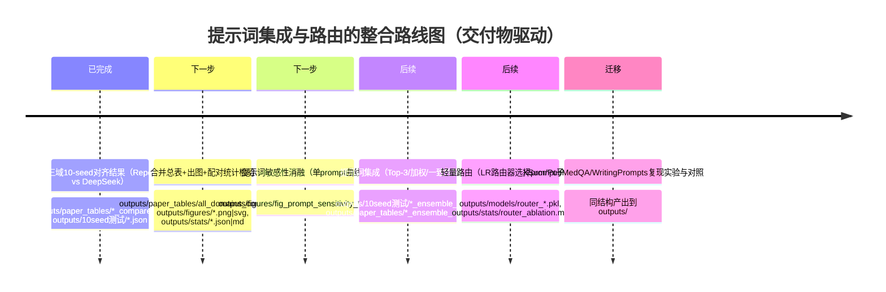

# 三域实验完成后的整合版路线图与变更说明

## 执行摘要

你现在已经完成了论文原仓库三域（Yelp / Code / Arxiv）在 **Repo rewrite vs DeepSeek rewrite** 两种重写器设定下的 **10-seed** 对照实验；这一步非常关键，相当于把“可对齐基线（aligned baseline）”做实了。下一步建议把工作**收敛为三条主线并一次性工程化留痕**：

- **主线一：把现有三域结果“论文级交付”**：合并表格、出对比图、做跨 seed 的配对统计检验（p 值 + 效应量 + 置信区间），并固化到 `outputs/`。配对 t 检验与 Wilcoxon 的定义与假设可直接引用 entity["organization","SciPy","python scientific toolkit"] 文档来支撑方法论写作。citeturn7view0turn6view0turn5search5  
- **主线二：把“提示词敏感性 → 集成 → 路由”从计划落到可运行实验**：你已经有多提示词的重写输出结构（例如 Arxiv DeepSeek 的 `multi_seed_summary.acc_list/f1_list` 形式），适合直接做 prompt 子集消融、加权集成、路由（先离线模拟选择 prompt 子集，不需要立刻额外调用 API）。fileciteturn0file0  
- **主线三：把开题报告的三大主战场域（XSum / PubMedQA / WritingPrompts）纳入同一套流水线**：用你已经跑通的三域脚手架作为模板迁移，保证“论文主线数据域”与“原文复现域”在同一评估范式下可对比。

下面给你 **立刻可跑的三条命令**（均可在项目根目录执行），对应：(a) 合并表格，(b) 出 Acc/F1 柱状图（带误差棒），(c) Repo vs DeepSeek 配对统计检验产物（json+md）：

**(a) 合并三域 compare CSV → 总表（CSV+MD）**

```powershell
cd "E:\jnu\Final_thesis\实验\Raidar\RaidarLLMDetect"
python -c "import pandas as pd, glob, os; pt=r'outputs\paper_tables'; fs=sorted(glob.glob(os.path.join(pt,'*_compare.csv'))); assert fs, 'no *_compare.csv in '+pt; df=pd.concat([pd.read_csv(f).assign(_file=os.path.basename(f)) for f in fs], ignore_index=True); df=df.sort_values(['Domain','Setting']).reset_index(drop=True); out_csv=os.path.join(pt,'all_domains_compare.csv'); df.to_csv(out_csv,index=False,encoding='utf-8-sig'); cols=[c for c in df.columns if c!='_file']; md=['| '+' | '.join(cols)+' |','| '+' | '.join(['---']*len(cols))+' |']; md+=['| '+' | '.join(str(v).replace('\\n',' ') for v in row)+' |' for row in df[cols].itertuples(index=False,name=None)]; out_md=os.path.join(pt,'all_domains_compare.md'); open(out_md,'w',encoding='utf-8').write('\\n'.join(md)); print('saved',out_csv); print('saved',out_md)"
```

（如果你想直接 `df.to_markdown()` 输出 Markdown，需要额外装 `tabulate`；这是 entity["organization","pandas","python data analysis library"] 的可选依赖。citeturn8search0turn8search1）

**(b) 基于总表生成图：Accuracy / F1（PNG+SVG）**

```powershell
cd "E:\jnu\Final_thesis\实验\Raidar\RaidarLLMDetect"
python -c "import pandas as pd, os, re, numpy as np; import matplotlib.pyplot as plt; pt=r'outputs\paper_tables'; df=pd.read_csv(os.path.join(pt,'all_domains_compare.csv')); os.makedirs(r'outputs\\figures', exist_ok=True); def parse_ms(s): a=re.split(r'\\s*±\\s*', str(s)); return float(a[0]), (float(a[1]) if len(a)>1 else 0.0); df[['acc_mean','acc_std']]=df['Accuracy(mean±std)'].apply(lambda x: pd.Series(parse_ms(x))); df[['f1_mean','f1_std']]=df['F1(mean±std)'].apply(lambda x: pd.Series(parse_ms(x))); dom=list(dict.fromkeys(df['Domain'].tolist())); stg=list(dict.fromkeys(df['Setting'].tolist())); w=0.35; x=np.arange(len(dom)); def plot(metric,ylab,fn): plt.figure(); for j,s in enumerate(stg): sub=df[df['Setting']==s].set_index('Domain').reindex(dom); m=sub[f'{metric}_mean'].values; e=sub[f'{metric}_std'].values; xpos=x+(j-(len(stg)-1)/2)*w; plt.bar(xpos,m,width=w,label=s); plt.errorbar(xpos,m,yerr=e,fmt='none',capsize=3); plt.xticks(x,dom); plt.ylabel(ylab); plt.legend(); plt.tight_layout(); plt.savefig(os.path.join(r'outputs\\figures',fn+'.png'),dpi=300); plt.savefig(os.path.join(r'outputs\\figures',fn+'.svg')); plt.close(); plot('acc','Accuracy','fig_acc_repo_vs_deepseek'); plot('f1','F1','fig_f1_repo_vs_deepseek'); print('saved to outputs\\\\figures')"
```

图保存用 `savefig()`；误差棒用 `errorbar()`；这两个 API 的标准用法可在 entity["organization","Matplotlib","python plotting library"] 官方文档引用。citeturn3search2turn4search2  

**(c) Repo vs DeepSeek：配对 t-test + Wilcoxon + 效应量 + Bootstrap CI（输出 json+md）**

> 该命令默认你 10-seed 结果 JSON 在 `outputs\10seed测试\`：  
> `yelp_repo_*.json / yelp_deepseek_*.json / code_repo_*.json / code_deepseek_*.json / arxiv_repo_*.json / arxiv_deepseek_*.json`  
> 且每个 JSON 含 `multi_seed_summary.acc_list/f1_list/seeds`（Arxiv DeepSeek 示例确实如此）。fileciteturn0file0  

```powershell
cd "E:\jnu\Final_thesis\实验\Raidar\RaidarLLMDetect"
python -c "import os, json, math, numpy as np; from scipy import stats; root=r'outputs\\10seed测试'; outdir=r'outputs\\stats'; os.makedirs(outdir, exist_ok=True); pairs={'Yelp':('yelp_repo','yelp_deepseek'),'Code':('code_repo','code_deepseek'),'Arxiv':('arxiv_repo','arxiv_deepseek')}; def find(prefix): import glob; fs=sorted(glob.glob(os.path.join(root,prefix+'*.json'))); assert fs, 'missing '+prefix+'*.json in '+root; return fs[0]; def load_lists(p): j=json.load(open(p,'r',encoding='utf-8')); ms=j.get('multi_seed_summary',{}); return ms['seeds'], np.array(ms['acc_list'],float), np.array(ms['f1_list'],float); def bh_fdr(pvals): p=np.array(pvals,float); m=len(p); idx=np.argsort(p); q=np.empty(m); prev=1.0; for rank,i in enumerate(idx[::-1], start=1): k=m-rank+1; prev=min(prev, p[i]*m/k); q[i]=prev; return q.tolist(); def rank_biserial_from_wilcoxon_stat(T,n): S=n*(n+1)/2.0; return 1.0 - (2.0*T)/S; def analyze(a,b): d=b-a; n=len(d); sh=stats.shapiro(d).pvalue if n>=3 else float('nan'); tt=stats.ttest_rel(b,a,alternative='two-sided'); ww=stats.wilcoxon(b,a,alternative='two-sided',zero_method='wilcox',method='auto'); dz=float(np.mean(d)/np.std(d,ddof=1)) if np.std(d,ddof=1)>0 else float('nan'); J=1.0-3.0/(4.0*n-1.0) if n>1 else 1.0; g=float(J*dz) if not math.isnan(dz) else float('nan'); r_rb=float(rank_biserial_from_wilcoxon_stat(float(ww.statistic),n)); boot=stats.bootstrap((d,), np.mean, confidence_level=0.95, n_resamples=20000, method='BCa', random_state=0); ci=(float(boot.confidence_interval.low), float(boot.confidence_interval.high)); return {'n':n,'diff_mean':float(np.mean(d)),'diff_std':float(np.std(d,ddof=1)),'shapiro_p':float(sh),'ttest':{'t':float(tt.statistic),'p':float(tt.pvalue)},'wilcoxon':{'T':float(ww.statistic),'p':float(ww.pvalue)},'effect':{'cohen_dz':dz,'hedges_g':g,'rank_biserial_r':r_rb},'boot_ci95_mean_diff':{'low':ci[0],'high':ci[1]}}; res={'meta':{'root':root,'compare':'DeepSeek - Repo','tests':['paired t-test','wilcoxon','bootstrap CI (BCa)']},'domains':{},'p_adjust':{}}; p_acc=[]; p_f1=[]; keys=[]; for dom,(pre_r,pre_d) in pairs.items(): pr=find(pre_r); pd=find(pre_d); seeds_r,acc_r,f1_r=load_lists(pr); seeds_d,acc_d,f1_d=load_lists(pd); assert seeds_r==seeds_d, dom+' seeds mismatch'; res['domains'][dom]={'paths':{'repo':pr,'deepseek':pd},'seeds':seeds_r,'acc':analyze(acc_r,acc_d),'f1':analyze(f1_r,f1_d)}; p_acc.append(res['domains'][dom]['acc']['ttest']['p']); p_f1.append(res['domains'][dom]['f1']['ttest']['p']); keys.append(dom); q_acc=bh_fdr(p_acc); q_f1=bh_fdr(p_f1); res['p_adjust']={'method':'BH-FDR on paired t-test p','acc':{k:float(q) for k,q in zip(keys,q_acc)},'f1':{k:float(q) for k,q in zip(keys,q_f1)}}; out_json=os.path.join(outdir,'paired_stats_repo_vs_deepseek.json'); json.dump(res, open(out_json,'w',encoding='utf-8'), ensure_ascii=False, indent=2); md=['# Repo vs DeepSeek 配对统计检验','']; md+=['说明：差值定义为 DeepSeek - Repo；t-test 为配对样本；Wilcoxon 为符号秩检验；CI 用 bootstrap(BCa)。','']; md.append('| Domain | Metric | mean(diff) | std(diff) | t p | wilcoxon p | dz | r_rb | CI95 low | CI95 high |'); md.append('|---|---:|---:|---:|---:|---:|---:|---:|---:|---:|'); for dom in keys: for m in ['acc','f1']: r=res['domains'][dom][m]; md.append(f\"| {dom} | {m} | {r['diff_mean']:.4f} | {r['diff_std']:.4f} | {r['ttest']['p']:.4g} | {r['wilcoxon']['p']:.4g} | {r['effect']['cohen_dz']:.3f} | {r['effect']['rank_biserial_r']:.3f} | {r['boot_ci95_mean_diff']['low']:.4f} | {r['boot_ci95_mean_diff']['high']:.4f} |\"); out_md=os.path.join(outdir,'paired_stats_repo_vs_deepseek.md'); open(out_md,'w',encoding='utf-8').write('\\n'.join(md)); print('saved',out_json); print('saved',out_md)"
```

为何这套检验写进论文“站得住”：  
- 配对 t-test 适用于“同一 seed 下两设定成对对比”，其原假设就是“配对样本均值相同”。citeturn7view0  
- Wilcoxon 符号秩检验检验“差值分布是否以 0 为对称中心”，是配对 t-test 的非参数版本之一；统计量在双侧情形下是“正负秩和中较小者”。citeturn6view0  
- Bootstrap 的 BCa（bias-corrected and accelerated）区间是更常用的自助法区间之一，entity["organization","SciPy","python scientific toolkit"] 的 `bootstrap(..., method='BCa')` 文档把 percentile/basic/BCa 的差别与可复现 RNG 用法写得很清楚。citeturn9view0turn2search6turn2search10  

---

## 整合后的研究路线图

你的两份“上一阶段计划”里，核心逻辑是一致的：先建立可对齐基线，再证明提示词敏感性，再提出集成与路由。你现在多做了一件“加分项”：把 **论文原仓库三域**做到了可对齐与多 seed 的稳定结果，这可以作为论文中“复现有效性”的硬证据（同时也能为后续迁移到 XSum / PubMedQA / WritingPrompts 提供脚手架）。

建议将路线图整合为四个“可验收交付阶段”（每阶段都产出明确文件到 `outputs/`）：

- **阶段 A（已完成，但需要“论文级固化”）**：三域 Repo vs DeepSeek 的 10-seed 对照，生成总表、图、统计检验文件，以及一个复现实验清单 README。  
- **阶段 B（提示词敏感性）**：把每个 prompt 单独做消融（单 prompt 特征/单 prompt 阈值/单 prompt 分类器），画出“prompt → Acc/F1”的跨 prompt 波动图；这是你“为什么需要集成”的证据链。你现有的多提示重写输出结构（脚本中 yelp/arxiv 7 个提示词、code 5 个提示词）可以直接用来做这步，无需额外生成。fileciteturn0file3  
- **阶段 C（提示词集成）**：从“全 prompts”到“Top-3 prompts”到“加权集成”，对比性能与稳定性；再加一条“成本视角”——如果未来只调用 Top-3 prompts，你能把重写 API 调用次数从 K 降到 3（本地模拟时不需要额外花费）。  
- **阶段 D（提示词路由）**：先做 **离线路由模拟**（用输入表层特征或 embedding 的低成本特征，训练一个路由器选择 prompt 子集），比较“固定 Top-3” vs “路由 Top-3” vs “全 prompts”的性能/稳定性/成本三者权衡。路由器用 entity["organization","scikit-learn","python ml library"] 的 LogisticRegression/LR-CV 即可满足“轻量、可解释”。citeturn0search2  

用一张 Mermaid 时间线把“已完成/下一步/后续”在论文里也很清晰（不写具体耗时，只写阶段产物）：



---

## 可复现交付物清单与一键命令

为了让后续写论文“零返工”，建议你把所有产物分为 5 类，并约定固定文件名模板：

| 产物类别 | 你应该得到什么 | 推荐落盘位置（留痕） | 备注 |
|---|---|---|---|
| 总表 | 全域对照总表（CSV+MD） | `outputs\paper_tables\all_domains_compare.csv/.md` | 已给命令 |
| 核心图 | Acc、F1 柱状图（含 mean±std） | `outputs\figures\fig_acc_*.png/.svg`、`fig_f1_*.png/.svg` | `savefig()` 支持 PNG/SVGciteturn3search2turn3search14 |
| 统计检验 | 配对 t-test + Wilcoxon + 效应量 + CI | `outputs\stats\paired_stats_repo_vs_deepseek.json/.md` | t-test 与 Wilcoxon 见文档citeturn7view0turn6view0 |
| 诊断解释 | 特征漂移 Top-k、PCA 图 | `outputs\diagnostics\*.csv/.png/.svg` | 见下一节；PCA 输入默认“中心化不缩放”，建议配 StandardScalerciteturn0search3turn4search0 |
| 复现信息 | 环境、命令、hash | `outputs\repro\requirements.txt / manifest_sha256.tsv / README_experiments.md` | RNG 可复现建议固定 seed；PCG64 固定 seed 的确定性有文档保证citeturn2search6turn2search10 |

两个非常建议你今天就加上的“复现留痕”命令（不涉及任何模型调用）：

**冻结依赖：**

```powershell
cd "E:\jnu\Final_thesis\实验\Raidar\RaidarLLMDetect"
New-Item -ItemType Directory -Force outputs\repro | Out-Null
python -m pip freeze > outputs\repro\requirements.txt
```

**生成关键文件 SHA256 清单：**

```powershell
cd "E:\jnu\Final_thesis\实验\Raidar\RaidarLLMDetect"
Get-ChildItem -Recurse outputs\paper_tables,outputs\figures,outputs\stats,outputs\10seed测试 -File | ForEach-Object { "{0}`t{1}" -f (Get-FileHash $_.FullName -Algorithm SHA256).Hash, $_.FullName } | Set-Content -Encoding UTF8 outputs\repro\manifest_sha256.tsv
```

---

## 从“上一版计划”到“当前整合版”的差异

你上一版计划（开题报告 + 复现范围文档）与现在的差异，核心不在“方向变了”，而在于**你已经提前完成了更扎实的可对齐基线**，因此路线图应当做以下“结构性改写”（建议你把这段直接写进论文方法章节的“实验设置与复现说明”里作为自洽叙事）：

- **范围与主线的关系调整**  
  - 旧：主战场强调 XSum / PubMedQA / WritingPrompts，Yelp/Code/Arxiv 属于可选扩展。  
  - 新：你已把 Yelp/Code/Arxiv 做成了“论文原仓库三域可对齐复现”，它不应再被视为“可选”，而应放到论文的 **复现有效性** 章节作为强基线；然后再迁移到开题主战场三域做“贡献验证”。（这会显著降低评审质疑“只做变体不复现”的风险。）

- **交付顺序的改变：先固化基线，再做方法创新**  
  - 旧：完成 baseline 后，较快进入 ensemble 与 routing。  
  - 新：由于你现在已有三域多 seed 对照，应该先补齐“论文级可复现产物”（总表、图、统计显著性与效应量），让后续任何方法改动都能跟这套基线 **一键对齐对照**。  
  统计方法层面，你现在引入“配对检验 + bootstrap CI +（可选）多重比较控制”会让结果段落更加严谨：配对 t 检验与 Wilcoxon 的假设、统计量定义与 SciPy 实现都可引用。citeturn7view0turn6view0turn9view0turn3search1  

- **“DeepSeek 替代对照”从小规模证明升级为可量化结论**  
  - 旧：更多是“做一个对照证明趋势仍成立”。  
  - 新：你可以用 **跨 seed 的配对差值分布**给出“DeepSeek 相对 Repo 的性能差距是显著/不显著、效应量多大、CI 落在什么区间”的量化表达（而不是只报一行 mean±std）。这一步完全不需要新调用，只做统计后处理即可。citeturn7view0turn6view0turn9view0  

- **提示词集成/路由的实现路径更工程化**  
  - 旧：更多从概念描述出发。  
  - 新：你可以先用“离线模拟”把路由做成 **不追加任何生成成本** 的实验：因为你已经为每条样本生成了多 prompt 的改写（脚本提示词池也已固定）。接下来 route/ensemble 只是在“从已有 prompt 子集中选哪些来组成特征/打分”——非常适合做系统消融。fileciteturn0file3  

---

## 下一步优先级与风险控制

下面给你一个“不再走弯路”的优先级（只分 **高/中/低**，不涉及耗时预测），并明确每项的输出文件，确保你每推进一步都能“落盘留痕”：

- **高优先级（立即做，且一定会写进论文结果段）**  
  1) 总表合并 + Acc/F1 图（PNG/SVG）  
  2) Repo vs DeepSeek 的配对统计报告（json+md），并在论文里至少引用：p 值、效应量、95%CI  
  这三项完全是“后处理”，依赖现有结果文件；且写作收益最大。统计检验与 CI 的实现细节都能引用 SciPy API 作为方法学依据。citeturn7view0turn6view0turn9view0  

- **中优先级（方法创新的第一层证据链）**  
  3) 提示词敏感性：把每个 prompt 单独测一遍，并输出每域的“prompt→性能”图（你可以在不重写的情况下，通过过滤 JSON 仅保留某个 prompt 字段来模拟单 prompt 特征）  
  4) Prompt ensemble：Top-3 / 加权 /（可选）一致性特征，输出消融表（CSV/MD）与图（ΔAcc/ΔF1）  

- **低优先级（更像论文加分项/附录项，做了更完整）**  
  5) 特征漂移诊断：Top-k 特征漂移表 + PCA 2D 散点图（解释“为什么 DeepSeek 可能更难分/更同质化”）  
  PCA 的“中心化不缩放”特性意味着你最好先做标准化；StandardScaler 的动机与用法在 scikit-learn 文档里很明确。citeturn0search3turn4search0  

最后提醒一个“最容易翻车但也最好防”的点：**随机性与可复现**。建议你在所有后处理脚本里固定 `random_state`（包括 bootstrap 的 `random_state`、t-SNE 的 `random_state`、以及任何训练器的 `random_state`），并把 seeds 列表写入输出 json。entity["organization","NumPy","python numerical computing"] 对 PCG64 的固定 seed 可复现性有明确兼容性保证；而 `default_rng` 不设 seed 会导致每次不同。citeturn2search6turn2search10  

如果你愿意，我也可以把“提示词敏感性（单 prompt）”与“Top-3 prompt 集成”的**最小可运行脚本**按你现有目录（读取 `rewrite_*_inv*.json`、输出到 `outputs\10seed测试\`、`outputs\paper_tables\`）写成两段可直接复制粘贴的命令模板，这样你后面迁移到 XSum / PubMedQA / WritingPrompts 只需要改路径与 `--domain`。