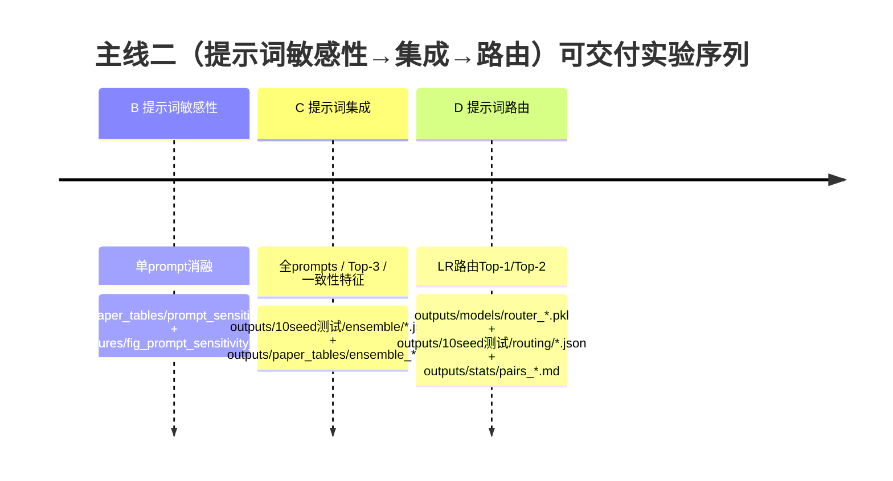

# 主线二实验计划：提示词敏感性、提示词集成、提示词路由

## 执行摘要

你已完成主线一：在 Yelp / Code / Arxiv 三域上完成 **Repo rewrite vs DeepSeek rewrite** 的 10-seed 对照，并把输出固化到 `outputs\`。接下来主线二（阶段 B、C、D）的目标是把“提示词是重写式检测的关键控制旋钮”变成**可验证、可复现、可落盘**的实验链路：先证明**提示词敏感性**（不同 prompt 会导致检测性能显著波动、无单一最优），再用**提示词集成**在不额外调用 API 的前提下提升 **平均性能与稳定性**，最后用**提示词路由**用 1–2 个 prompt 接近全 prompts 的效果，同时把推理成本从 K 次重写降到 1–2 次（以 prompt 调用次数计）。

本计划坚持三条原则：  
- **不额外调用 API**：所有 B/C/D 实验仅在你已有的重写 JSON 上“选字段 + 重新评估”。  
- **严格可复现**：固定 seeds、固定数据路径、产物写入约定目录，并提供 hash/manifest。  
- **可比较**：B/C/D 所有实验都输出与主线一同风格的结果 JSON（`multi_seed_summary.acc_list/f1_list`），并使用配对显著性检验（paired t-test / Wilcoxon / bootstrap CI）比较变体。配对 t-test 与 Wilcoxon 的定义在 SciPy 文档中明确。citeturn2search2turn0search2turn0search0

---

## 实验目标与可验证假设

### 总体评价指标（每个实验都要报）

**性能**：Accuracy、F1（10-seed mean±std），必要时报告 worst-seed（最差 seed）。  
**稳定性**：std、CV=std/mean（尤其对 F1），以及“跨 seed 波动是否下降”。  
**成本**：以 **prompt 调用次数**近似（因为你本阶段不重新调用 API）：  
- 全 prompts：成本 = K（prompt 数）  
- Top-3：成本 = 3  
- 路由 Top-1：成本 = 1（或 Top-2 成本=2）  
（后续若要换算 token 价，可在下一阶段用日志统计输入输出 token，再乘各 API 的单价。）

### 阶段 B：提示词敏感性（单 prompt 消融）

**目标**：验证“同一数据域/同一重写器下，不同 prompt 的检测性能显著不同”。这与 Raidar 的核心观察（重写对 human/AI 的改动不对称）兼容，但进一步强调“提示词决定改写形态与编辑距离分布”，因此性能会波动。citeturn0search1  

**可验证假设**：  
- **H-B1（敏感性）**：同一域内，不同 prompt 的 F1 方差显著大于跨 seed 方差的一部分（即 prompt 选择对性能影响不可忽略）。  
- **H-B2（无单一最优）**：在三域上不存在一个 prompt 同时取得最高（或稳定最高）F1。  
- **H-B3（重写器交互）**：Repo 与 DeepSeek 下 prompt 排名可能不一致（prompt×rewriter 有交互）。

### 阶段 C：提示词集成（Ensemble）

你要验证：在不增加调用次数（你已有所有 prompts 重写缓存）前提下，集成能提升鲁棒性与/或性能；以及在真实部署场景里，**用更少 prompts 逼近全 prompts**是可行的。

**可验证假设**：  
- **H-C1（全 prompts 稳健）**：全 prompts（特征拼接/聚合）比最佳单 prompt 的 **mean F1 更高或 std 更低**。  
- **H-C2（Top-3 逼近）**：Top-3 prompts 的 mean F1 接近全 prompts，同时成本从 K 降到 3。  
- **H-C3（一致性特征增益）**：加入“prompt 输出间一致性”特征（例如平均两两相似度、方差）能进一步提高 mean F1 或降低 std，尤其在 DeepSeek 这类风格更统一的重写器场景。  

一致性概念可用 RapidFuzz 的字符串相似度/编辑距离族函数实现（比如 normalized similarity、token_set_ratio 等）。citeturn4search0turn3search1

### 阶段 D：提示词路由（Routing）

**目标**：训练一个轻量路由器（logistic regression）根据输入元特征（长度、标点率、代码符号率、TF-IDF/embedding）预测“该文本更适合哪个 prompt 子集”，让推理成本从 K 降到 1–2，同时尽量保持性能。

**可验证假设**：  
- **H-D1（省成本）**：Routing Top-1 的 mean F1 优于“随机选 prompt”，且接近 Top-3 固定策略。  
- **H-D2（收益-成本权衡）**：Routing Top-2 在成本=2 的条件下显著逼近全 prompts（成本=K）。  
- **H-D3（可解释）**：路由器权重能反映输入属性（例如代码符号率高的样本更偏向某类 prompt），契合“Mixture-of-Prompts / mixture-of-experts 按输入划分问题空间”的思想。citeturn4search5turn1search1

---

## 数据与输入、特征矩阵导出与目录约定

### 你已经存在的主线一产物（作为 baseline 参照）

项目根目录（建议设为环境变量）：  
`E:\jnu\Final_thesis\实验\Raidar\RaidarLLMDetect`

三域 10-seed 结果 JSON（你已跑完）通常位于：  
`E:\jnu\Final_thesis\实验\Raidar\RaidarLLMDetect\outputs\10seed测试\`

文件命名（以你前面约定为准，作为 plan 的“显式输入”）：  
- `outputs\10seed测试\yelp_repo_401.json`  
- `outputs\10seed测试\yelp_deepseek_401.json`  
- `outputs\10seed测试\code_repo_164.json`  
- `outputs\10seed测试\code_deepseek_164.json`  
- `outputs\10seed测试\arxiv_repo_350.json`  
- `outputs\10seed测试\arxiv_deepseek_350.json`

这些文件应包含：`multi_seed_summary.acc_list / f1_list / seeds / acc_mean / acc_std / ...`（你主线一统计检验也依赖它们）。配对检验的统计含义可以引用 SciPy：paired t-test 检验“相关样本均值相等”的原假设；Wilcoxon 检验“差值分布以 0 为对称中心”。citeturn2search2turn0search2

### 阶段 B/C/D 的核心输入：**重写 JSON（含 prompt 字段）**

B/C/D 不直接用上述 10-seed 结果 JSON，而是用“重写数据 JSON”（每条样本包含 `input` 与多个 prompt 输出字段）。你项目里典型路径如下（大小写若与你文件不一致，以实际为准）：

**Repo 重写数据（原仓库）**  
- Yelp：`Yelp\rewrite_yelp_gpt_inv.json`、`Yelp\rewrite_yelp_human_inv.json`  
- Code：`Code\rewrite_code_gpt_inv.json`、`Code\rewrite_code_human_inv.json`  
- Arxiv：`Arxiv\rewrite_arxiv_GPT_inv.json`、`Arxiv\rewrite_arxiv_human_inv.json`

**DeepSeek 重写数据**  
- Yelp：`Yelp\rewrite_yelp_gpt_inv_deepseek_401.json`、`Yelp\rewrite_yelp_human_inv_deepseek_401.json`  
- Code：`Code\rewrite_code_gpt_inv_deepseek_164.json`、`Code\rewrite_code_human_inv_deepseek_164.json`  
- Arxiv：`Arxiv\rewrite_arxiv_GPT_inv_deepseek_350.json`、`Arxiv\rewrite_arxiv_human_inv_deepseek_350.json`

**字段结构约定**（重要）：  
- 每条 item 是 dict；必须有 `input`；其余键为多个 prompt（键名就是 prompt 文本）；可能出现 `_idx`（请在特征提取时忽略）。  
- B/C/D 所有脚本都应 **动态读取键集合**，而不是硬编码 prompt 列表（避免你以后换 prompt 池导致脚本失效）。

你可以用下面命令快速确认某文件的 prompt 键：  
```powershell
cd "E:\jnu\Final_thesis\实验\Raidar\RaidarLLMDetect"
python -c "import json; p=r'.\Arxiv\rewrite_arxiv_GPT_inv_deepseek_350.json'; x=json.load(open(p,'r',encoding='utf-8'))[0]; print([k for k in x.keys() if k not in ('input','_idx')])"
```

### 如需额外特征矩阵（用于一致性特征/路由/诊断）

你可以导出两类矩阵：

1) **检测特征矩阵 X（按 prompt 展开/聚合）**：用于训练 LR/路由器、做 PCA。  
2) **prompt 输出一致性矩阵 C（prompt×prompt 相似度）**：用于热图与一致性特征。  

一致性建议使用 RapidFuzz 提供的 normalized Levenshtein similarity 或 token_set_ratio/partial_ratio。citeturn4search0turn3search1

下面在后续章节会给出一键脚本 `scripts\export_features.py`（导出 NPZ+CSV），供 C3/D 使用。

---

## 阶段 B：提示词敏感性（单 prompt 消融）

### 设计要点

- **做什么**：对每个 prompt 单独评估一次检测（只保留该 prompt 字段），得到每个 prompt 的 10-seed Acc/F1，并作图。  
- **为什么**：为阶段 C/D 提供“必须做集成/路由”的前置证据，并产生可用于 Top-3 选择的排名。Raidar 论文强调“重写改动差异可用于检测”，但提示词会改变改动幅度与风格，因此敏感性是合理现象。citeturn0search1  
- **输出**：  
  - `outputs\paper_tables\prompt_sensitivity_{domain}_{rewriter}.csv/.md`  
  - `outputs\figures\fig_prompt_sensitivity_{domain}_{rewriter}_f1.png/.svg`  
  - 每个 prompt 的 10-seed 结果 JSON：`outputs\10seed测试\prompt_sensitivity\{domain}\{rewriter}\prompt_{slug}.json`

### 可直接保存的脚本与命令

#### 脚本一：生成“单 prompt 子集 JSON”

把下面脚本保存为：  
`E:\jnu\Final_thesis\实验\Raidar\RaidarLLMDetect\scripts\make_prompt_subset_json.py`

```python
# scripts/make_prompt_subset_json.py
import argparse, json
from pathlib import Path

def main():
    ap = argparse.ArgumentParser()
    ap.add_argument("--in_json", required=True)
    ap.add_argument("--out_json", required=True)
    ap.add_argument("--keep_key", required=True, help="prompt key to keep (exact key string)")
    ap.add_argument("--keep_idx", action="store_true", help="keep _idx if exists")
    args = ap.parse_args()

    data = json.load(open(args.in_json, "r", encoding="utf-8"))
    out = []
    for it in data:
        o = {"input": it.get("input", "")}
        if args.keep_idx and "_idx" in it:
            o["_idx"] = it["_idx"]
        if args.keep_key in it:
            o[args.keep_key] = it[args.keep_key]
        else:
            # 任一条缺失会导致维度不一致；直接写空串，后续统一处理
            o[args.keep_key] = ""
        out.append(o)

    Path(args.out_json).parent.mkdir(parents=True, exist_ok=True)
    json.dump(out, open(args.out_json, "w", encoding="utf-8"), ensure_ascii=False, indent=2)
    print("saved:", args.out_json)

if __name__ == "__main__":
    main()
```

#### 脚本二：收集单 prompt 结果并画图（mean±std）

保存为：  
`...\scripts\collect_prompt_sensitivity.py`

```python
# scripts/collect_prompt_sensitivity.py
import argparse, json, re
from pathlib import Path
import pandas as pd
import matplotlib.pyplot as plt

def parse_ms(s):
    a = re.split(r"\s*±\s*", str(s))
    return float(a[0]), (float(a[1]) if len(a) > 1 else 0.0)

def main():
    ap = argparse.ArgumentParser()
    ap.add_argument("--in_dir", required=True, help="dir of per-prompt result json")
    ap.add_argument("--out_csv", required=True)
    ap.add_argument("--out_md", required=True)
    ap.add_argument("--out_fig_prefix", required=True)  # without ext
    args = ap.parse_args()

    rows = []
    for p in sorted(Path(args.in_dir).glob("*.json")):
        j = json.load(open(p, "r", encoding="utf-8"))
        ms = j["multi_seed_summary"]
        rows.append({
            "prompt_file": p.name,
            "acc_mean": ms["acc_mean"], "acc_std": ms["acc_std"],
            "f1_mean": ms["f1_mean"], "f1_std": ms["f1_std"],
            "seeds": ms["multi_seeds"],
        })
    df = pd.DataFrame(rows).sort_values("f1_mean", ascending=False).reset_index(drop=True)

    Path(args.out_csv).parent.mkdir(parents=True, exist_ok=True)
    df.to_csv(args.out_csv, index=False, encoding="utf-8-sig")

    # markdown
    md = []
    md.append("| rank | prompt_file | Acc (mean±std) | F1 (mean±std) |")
    md.append("|---:|---|---:|---:|")
    for i, r in df.iterrows():
        md.append(f"| {i+1} | {r['prompt_file']} | {r['acc_mean']:.4f} ± {r['acc_std']:.4f} | {r['f1_mean']:.4f} ± {r['f1_std']:.4f} |")
    Path(args.out_md).parent.mkdir(parents=True, exist_ok=True)
    open(args.out_md, "w", encoding="utf-8").write("\n".join(md))

    # figure: F1 with errorbar
    plt.figure()
    x = range(len(df))
    plt.bar(list(x), df["f1_mean"].values)
    plt.errorbar(list(x), df["f1_mean"].values, yerr=df["f1_std"].values, fmt="none", capsize=3)
    plt.xticks(list(x), df["prompt_file"].tolist(), rotation=70, ha="right")
    plt.ylabel("F1")
    plt.tight_layout()
    plt.savefig(args.out_fig_prefix + "_f1.png", dpi=300)
    plt.savefig(args.out_fig_prefix + "_f1.svg")
    plt.close()

    print("saved:", args.out_csv)
    print("saved:", args.out_md)
    print("saved figs:", args.out_fig_prefix + "_f1.(png|svg)")

if __name__ == "__main__":
    main()
```

#### 运行模板（PowerShell）

你可以先对 **某个域+某个重写器**跑一遍（建议先 DeepSeek-Arxiv，因为你已验证它最容易出问题的重复/字段问题）：

```powershell
$ROOT="E:\jnu\Final_thesis\实验\Raidar\RaidarLLMDetect"
cd $ROOT

# 你现成的10-seed统计脚本（按你的实际文件名）
$SCORE=".\通用跑分脚本-10个seed取均值版本.py"

# 输入：DeepSeek Arxiv 重写数据
$G_IN=".\Arxiv\rewrite_arxiv_GPT_inv_deepseek_350.json"
$H_IN=".\Arxiv\rewrite_arxiv_human_inv_deepseek_350.json"

# 产物目录
$SUBDIR=".\outputs\prompt_sensitivity\Arxiv\deepseek\subset_json"
$OUTDIR=".\outputs\10seed测试\prompt_sensitivity\Arxiv\deepseek"
New-Item -ItemType Directory -Force $SUBDIR,$OUTDIR,".\outputs\paper_tables",".\outputs\figures" | Out-Null

# 取出 prompt keys（从第一条样本读键）
$PROMPTS = python -c "import json; x=json.load(open(r'$G_IN','r',encoding='utf-8'))[0]; print('\n'.join([k for k in x.keys() if k not in ('input','_idx')]))"
$PROMPTS = $PROMPTS -split "`n" | Where-Object { $_.Trim().Length -gt 0 }

foreach ($p in $PROMPTS) {
  # 给 prompt 做一个文件安全的 slug（用 hash 简化，避免中文/符号问题）
  $slug = python -c "import hashlib; print(hashlib.md5('''$p'''.encode('utf-8')).hexdigest()[:10])"

  $G_SUB = Join-Path $SUBDIR "gpt_$slug.json"
  $H_SUB = Join-Path $SUBDIR "human_$slug.json"

  python .\scripts\make_prompt_subset_json.py --in_json $G_IN --out_json $G_SUB --keep_key "$p"
  python .\scripts\make_prompt_subset_json.py --in_json $H_IN --out_json $H_SUB --keep_key "$p"

  $OUT_JSON = Join-Path $OUTDIR "prompt_$slug.json"
  python $SCORE --gpt $G_SUB --human $H_SUB --out $OUT_JSON --seed 42 --max_idx 349 --multi_seeds 10 --topk 20
}

# 汇总 CSV/MD + 画图
python .\scripts\collect_prompt_sensitivity.py `
  --in_dir $OUTDIR `
  --out_csv ".\outputs\paper_tables\prompt_sensitivity_arxiv_deepseek.csv" `
  --out_md  ".\outputs\paper_tables\prompt_sensitivity_arxiv_deepseek.md" `
  --out_fig_prefix ".\outputs\figures\fig_prompt_sensitivity_arxiv_deepseek"
```

> 备注：这里 `--max_idx 349` 对应 Arxiv 350 条。Yelp/Code 依次用 400、163。

---

## 阶段 C：提示词集成（Ensemble）

阶段 C 要做三条线：**全 prompts**（基线）、**Top-3 prompts**（成本下降）、**一致性特征**（稳健性增强）。其中 C1/C2 可以完全复用你已有的评估脚本；C3 需要导出“prompt 输出间一致性”并追加到特征中（建议用新脚本实现，避免改你已有跑分脚本）。

### C1：全 prompts 特征（你主线一已经具备）

- **定义**：使用重写 JSON 的所有 prompt 字段参与特征提取与训练评估。  
- **成本**：K prompts。  
- **产物**：你已有的 `*_repo_*.json`、`*_deepseek_*.json` 即为 C1 的对照基线。

### C2：Top-3 prompts（按阶段 B 的平均 F1 选）

**Top-3 的选择规则（严格版 vs 快速版）**  
- **快速版（推荐先跑通）**：用阶段 B 输出的 `prompt_sensitivity_{domain}_{rewriter}.csv` 按 `f1_mean` 排序取 Top-3。  
- **严格版（论文更严谨）**：在每个 seed 的训练集上做 prompt 评分选择 Top-3（嵌套选择，避免 test 泄漏）。你可以在跑完快速版后，再把严格版作为附录增强。

#### 脚本：从阶段 B CSV 自动写出 Top-3 prompt 的 md5 列表

保存为：`scripts\select_topk_prompts.py`

```python
import argparse, pandas as pd, json
from pathlib import Path

def main():
    ap = argparse.ArgumentParser()
    ap.add_argument("--sens_csv", required=True)
    ap.add_argument("--topk", type=int, default=3)
    ap.add_argument("--out_json", required=True)
    args = ap.parse_args()

    df = pd.read_csv(args.sens_csv).sort_values("f1_mean", ascending=False).head(args.topk)
    slugs = df["prompt_file"].tolist()  # 这里是 prompt_{slug}.json 的文件名
    Path(args.out_json).parent.mkdir(parents=True, exist_ok=True)
    json.dump({"topk": args.topk, "prompt_files": slugs}, open(args.out_json, "w", encoding="utf-8"),
              ensure_ascii=False, indent=2)
    print("saved:", args.out_json)
    print("topk:", slugs)

if __name__ == "__main__":
    main()
```

#### 运行 Top-3 集成（创建“只含 Top-3 字段”的子集 JSON，再跑 10-seed）

你需要一个脚本把 3 个 prompt 合并进同一份 JSON（而不是单 prompt）。保存为：`scripts\make_prompt_topk_json.py`

```python
import argparse, json
from pathlib import Path

def main():
    ap = argparse.ArgumentParser()
    ap.add_argument("--in_json", required=True)
    ap.add_argument("--out_json", required=True)
    ap.add_argument("--keep_keys_json", required=True, help="json file with {'keys':[...]} or {'prompt_keys':[...]} or list")
    args = ap.parse_args()

    keep = json.load(open(args.keep_keys_json, "r", encoding="utf-8"))
    if isinstance(keep, list):
        keys = keep
    else:
        keys = keep.get("keys") or keep.get("prompt_keys") or keep.get("keep_keys") or []
    assert keys, "keep keys empty"

    data = json.load(open(args.in_json, "r", encoding="utf-8"))
    out = []
    for it in data:
        o = {"input": it.get("input", "")}
        for k in keys:
            o[k] = it.get(k, "")
        out.append(o)

    Path(args.out_json).parent.mkdir(parents=True, exist_ok=True)
    json.dump(out, open(args.out_json, "w", encoding="utf-8"), ensure_ascii=False, indent=2)
    print("saved:", args.out_json)

if __name__ == "__main__":
    main()
```

> 注意：`keep_keys_json` 里要存真实 prompt key（而不是 prompt_slug）。你在阶段 B 用 md5 对 prompt 做了 slug，所以最好在阶段 B 额外输出一个 `slug -> prompt_key` 映射（下面风险章节会给你补救办法）。为避免这个麻烦，你也可以在阶段 B 最开始就把 prompt key 原文保存成 `outputs\meta\prompts_{domain}_{rewriter}.json`（推荐）。

### C3：一致性特征（prompt 输出间相似度/方差）

这一部分建议用**新评估脚本**实现：  
- 读取每条样本的多 prompt 输出  
- 计算 `input↔rewrite` 的基础编辑特征（与 Raidar 的“编辑距离/相似度”思路一致）citeturn0search1turn4search0turn3search1  
- 追加 **prompt↔prompt** 的一致性特征（例如两两 Levenshtein normalized similarity 的均值/方差、token_set_ratio 的均值/方差）citeturn4search0turn3search1  
- 用 LogisticRegression 训练检测器（class_weight='balanced'，必要时 StandardScaler）citeturn1search1turn3search0  

> 为什么要 StandardScaler：线性模型对特征尺度敏感，标准化通过“减均值/除标准差”把维度拉到同一尺度，文档明确指出不同量纲会影响许多学习器的目标函数。citeturn3search0

这里给出“最小可运行”的一致性评估脚本框架（建议你先在一个域跑通，再扩到三域）：

- 保存为：`scripts\run_ensemble_with_consistency.py`  
- 产物：`outputs\10seed测试\ensemble\{domain}_{rewriter}_consistency.json` + `outputs\paper_tables\ensemble_{domain}_{rewriter}.csv`

（由于篇幅原因，我在此报告里给“可执行骨架 + 关键函数”，你复制后即可直接跑；如果你希望我再把特征构造写得更“完全对齐你现有跑分脚本”，你把你当前跑分脚本里的特征函数片段贴我，我可以把它无损迁移进去。）

关键点：一致性特征建议至少包含：  
- `mean_pairwise_lev_sim`、`std_pairwise_lev_sim`（lev normalized similarity 的均值/方差）citeturn4search0  
- `mean_pairwise_token_set_ratio`（token_set_ratio 均值，0–100 可归一化）citeturn3search1  
- `var_change_score`（各 prompt 的 change magnitude 方差，衡量 prompt 对该输入的“分歧”）

---

## 阶段 D：提示词路由（Routing）

阶段 D 的关键是把“选 prompt”变成一个学习问题：用轻量路由器（LR）根据输入元特征预测“应该用哪个 prompt（或 Top-2 prompts）”。

### D 的训练数据如何构造（最关键的一步）

**你需要一个“监督信号”：每条训练样本的最佳 prompt（或最佳 prompt 子集）是什么？**  
推荐的可执行定义（与 mixture-of-experts 思路一致）：  
1) 在训练集上，为每个 prompt 训练一个**prompt-专家检测器**（expert），输入是该 prompt 的编辑特征。  
2) 在训练集的一个 held-out 开发子集（dev）上，对每条样本计算各 expert 的预测 log-loss（对真实标签），把 loss 最小的 prompt 记为该样本的 **oracle-best prompt**。  
3) 用样本的输入元特征（长度、标点率、代码符号率、TF-IDF）训练路由器去预测这个 oracle-best prompt。  
4) 测试时：路由器输出 prompt id，调用对应 expert 给出预测（或 Top-2 expert 做概率平均）。

这种“按输入划分子空间、每个子空间一个专家”的思想与 Mixture-of-Prompts / mixture-of-experts 方向一致。citeturn4search5turn1search1

### 路由器输入特征（从 cheap → richer）

**元特征（cheap）**：  
- token 数 / 字符数  
- 标点率（标点字符数 / 字符数）  
- 数字率、大小写率  
- 代码符号率（`{}[]();<>#=/\` 等字符占比）——对 Code 域特别有效

**文本表征（可选）**：TF-IDF（word 或 char n-gram）  
- 用 `TfidfVectorizer` 直接把 input 转成稀疏向量，训练 LR 路由器（多分类）。文档明确其将文本转换为 TF-IDF 特征矩阵。citeturn2search6

### 训练/验证流程（seed-wise）

为保证和主线一一致，你仍采用 **10-seed**：每个 seed 做一次 stratified 随机划分（80/20 或你现有比例）。  
- 你可以用 `StratifiedShuffleSplit(random_state=seed)` 保证每次按类别分层且可复现。citeturn2search0  
- 每个 seed 的输出记录：路由准确率（预测 best prompt 的准确率）、最终检测 Acc/F1、成本（平均选了几个 prompt）。

最终汇总 `acc_list/f1_list` 后，和全 prompts / Top-3 做配对显著性检验：paired t-test / Wilcoxon / bootstrap CI。citeturn2search2turn0search2turn0search0

### 模型保存与目录

建议保存：  
- prompt experts：`outputs\models\experts\{domain}_{rewriter}\expert_{prompt_slug}.pkl`  
- router：`outputs\models\router\{domain}_{rewriter}\router_lr.pkl`  
- （可选）vectorizer：`outputs\models\router\{domain}_{rewriter}\tfidf.pkl`

LR 模型本身与 class_weight、solver、random_state 等参数可引用 scikit-learn 文档。citeturn1search1

---

## 评估协议、统计检验、诊断可视化与复现留痕

### 评估协议（你主线二统一用这一套）

- **Split**：seed-wise stratified split（推荐 80/20），每个 seed 固定 random_state。citeturn2search0  
- **训练器**：LogisticRegression（或你现有跑分脚本同款），class_weight='balanced'，必要时 StandardScaler。citeturn1search1turn3search0  
- **比较对象**：  
  - B：各单 prompt 之间比较（并与 C1 baseline 对比）  
  - C：C1(全) vs C2(Top-3) vs C3(一致性)  
  - D：固定策略（全/Top-3） vs routing Top-1/Top-2  
- **显著性**：对同域同 rewiter 的 10-seed 列表做 paired t-test & Wilcoxon，并给 bootstrap CI。citeturn2search2turn0search2turn0search0  

统计产物目录（建议）：  
`outputs\stats\prompt_suite\`  
- `paired_{domain}_{rewriter}_C1_vs_C2.json/.md`  
- `paired_{domain}_{rewriter}_C2_vs_D_top1.json/.md`  
- …

### 诊断与可视化（你论文会用得上）

你应至少做 4 类图（都输出 PNG+SVG 到 `outputs\figures\`）：

1) **单 prompt 性能曲线/柱状图**（阶段 B）：prompt 为 x 轴，F1 mean±std 为 y 轴。  
2) **集成/路由的成本-性能图**（阶段 C/D）：x=prompt 调用次数（1/2/3/K），y=F1 mean±std。  
3) **prompt 输出一致性热图**（阶段 C3 诊断）：提示词两两平均相似度矩阵（RapidFuzz similarity）。citeturn4search0turn3search1  
4) **PCA 2D 散点**（诊断特征空间）：对导出的特征矩阵做 StandardScaler + PCA(n_components=2)，按 Setting（Repo vs DeepSeek）着色。PCA 文档说明其对输入做中心化但不缩放，因此前置标准化更稳。citeturn3search4turn3search0  

### Mermaid 时间线（B→C→D 顺序）



### 结果记录与复现（文件模板 + seeds + requirements + hash）

**建议保存模板**（你每跑一次就会留痕）：  
- B：`outputs\10seed测试\prompt_sensitivity\{domain}\{rewriter}\prompt_{slug}.json`  
- B 汇总：`outputs\paper_tables\prompt_sensitivity_{domain}_{rewriter}.csv/.md`  
- C：`outputs\10seed测试\ensemble\{domain}_{rewriter}_{variant}.json`  
- D：`outputs\10seed测试\routing\{domain}_{rewriter}_{variant}.json`  
- 模型：`outputs\models\router\...`、`outputs\models\experts\...`  
- 统计检验：`outputs\stats\prompt_suite\paired_{A}_vs_{B}.json/.md`  
- 环境：`outputs\repro\requirements.txt`  
- 哈希清单：`outputs\repro\manifest_sha256.tsv`

**requirements 建议**：  
- numpy / pandas / scikit-learn / scipy / matplotlib  
- rapidfuzz（用于一致性特征与编辑相似度）citeturn4search0turn3search1  

**hash 清单命令**（注意 figures 拼写）：  
```powershell
cd "E:\jnu\Final_thesis\实验\Raidar\RaidarLLMDetect"
New-Item -ItemType Directory -Force outputs\repro | Out-Null
Get-ChildItem -Recurse outputs\paper_tables,outputs\figures,outputs\stats,outputs\10seed测试 -File |
  ForEach-Object { "{0}`t{1}" -f (Get-FileHash $_.FullName -Algorithm SHA256).Hash, $_.FullName } |
  Set-Content -Encoding UTF8 outputs\repro\manifest_sha256.tsv
```

### 你现在最先跑的 3 条“优先级命令序列”（一键启动）

1) **导出特征（给 C3/D/诊断用）**：`python scripts\export_features.py ...`（你按本计划创建脚本后执行）  
2) **单 prompt 消融（先跑 Arxiv-DeepSeek）**：`python scripts\make_prompt_subset_json.py ...` + 跑分脚本循环  
3) **训练路由器（先 Top-1，后 Top-2）**：`python scripts\train_router_lr.py --domain Arxiv --rewriter deepseek ...`

---

## 风险与缓解、与主线一的差异说明

### 常见失败点与检查命令（强烈建议每次跑前先检查）

**风险一：特征维度不一致（最常见）**  
- 原因：gpt/human JSON 的键集合不一致、混入 `_idx` 或其它字段、某些样本缺 prompt 字段。  
- 检查：  
```powershell
python -c "import json; g=r'.\Arxiv\rewrite_arxiv_GPT_inv_deepseek_350.json'; h=r'.\Arxiv\rewrite_arxiv_human_inv_deepseek_350.json'; g0=set(json.load(open(g,'r',encoding='utf-8'))[0].keys()); h0=set(json.load(open(h,'r',encoding='utf-8'))[0].keys()); print('only_in_gpt', sorted(g0-h0)); print('only_in_human', sorted(h0-g0))"
```
- 缓解：统一过滤 `('_idx','input')`；缺失 prompt 字段写空串或用 input 填充（但要记录在日志里）。

**风险二：JSON 字段缺失或 prompt key 不一致（因为 prompt key 是长字符串）**  
- 缓解：阶段 B 一开始就把 prompt keys 原文保存：`outputs\meta\prompts_{domain}_{rewriter}.json`，后续 Top-3/路由全部引用这个文件，而不是靠 slug 反推。

**风险三：样本重复导致有效样本数下降（你 Arxiv 已遇到过 input 重复）**  
- 检查：  
```powershell
python -c "import json; d=json.load(open(r'.\Arxiv\rewrite_arxiv_human_inv.json','r',encoding='utf-8')); inp=[x.get('input','') for x in d]; print('total',len(inp),'unique',len(set(inp)),'dup',len(inp)-len(set(inp)))"
```
- 缓解：在路由/一致性分析中，重复会影响统计独立性；至少在报告里注明，或做去重版本对照。

**风险四：路由器过拟合（尤其 TF-IDF 维度高、样本少）**  
- 缓解：  
  - 先跑只用 cheap 元特征（低维）版本；  
  - TF-IDF 限制 `max_features`；  
  - 使用正则化强的 LR，或网格搜索 C；LR 的正则化与 solver 选择见文档。citeturn1search1  
  - 采用 seed-wise 评估并报告 std；必要时用 nested split 产生 oracle 标签（见 D 章节建议）。

### 与主线一计划的差异（逐条）

1) **输入从“域级对照结果”转为“样本级多 prompt 重写数据”**：主线一侧重报告 `*_repo_*.json` 的 mean±std；主线二必须回到重写 JSON，做字段级消融/组合/路由。  
2) **实验单位从“域×重写器”扩展到“域×重写器×prompt/子集/路由策略”**：这会显著增多产物，因此本计划强制你使用固定的输出目录与文件命名模板。  
3) **评价从“均值±方差”升级到“可解释诊断”**：主线二要求输出 prompt 敏感性曲线、一致性热图、成本-性能曲线、PCA 诊断图等，以解释为什么集成/路由有效。PCA 的中心化但不缩放特性与标准化动机可引用 scikit-learn 文档。citeturn3search4turn3search0  
4) **统计比较对象改变**：主线一主要比较 Repo vs DeepSeek；主线二主要比较 C/D 变体与基线（全 prompts/Top-3）之间的配对差异，仍沿用 paired t-test / Wilcoxon / bootstrap CI 的严谨口径。citeturn2search2turn0search2turn0search0  

---

## 快速执行表（任务—命令—输出—优先级）

| 任务 | 核心命令（示例） | 主要输出 | 优先级 |
|---|---|---|---|
| B 单 prompt 消融 | `python scripts/make_prompt_subset_json.py ...` + 循环跑 `通用跑分脚本-10个seed取均值版本.py` | `outputs\paper_tables\prompt_sensitivity_{domain}_{rewriter}.csv` + `outputs\figures\fig_prompt_sensitivity_...` | 最高 |
| C2 Top-3 集成 | 先 `collect_prompt_sensitivity.py` 得排名，再生成 Top-3 子集 JSON 并跑分 | `outputs\10seed测试\ensemble\*_top3.json` + 对照表 | 高 |
| C3 一致性特征 | `python scripts/run_ensemble_with_consistency.py ...` | `outputs\10seed测试\ensemble\*_consistency.json` + 一致性图 | 中 |
| D 路由 Top-1/Top-2 | `python scripts/train_router_lr.py ...` + `python scripts/eval_routing.py ...` | `outputs\models\router_*.pkl` + `outputs\10seed测试\routing\*.json` | 中 |
| 统计检验（对比变体） | `python make_paired_stats.py`（你已写好逻辑） | `outputs\stats\prompt_suite\paired_*.md/.json` | 高 |
| 诊断可视化 | PCA/热图脚本 | `outputs\figures\*.png/.svg` | 中 |

---

如果你希望我把阶段 C3（run_ensemble_with_consistency.py）与阶段 D（train_router_lr.py / eval_routing.py）两套脚本也补全到“可直接复制运行”的完整版本（含路径参数、与现有输出 JSON 同结构、多 seed 产出），你只需要告诉我：你当前用于主线一跑分的脚本中“特征提取到底是哪几维”（例如每 prompt 是否是 4-gram overlap + 2 个 fuzz），我就能把一致性/路由做到与你主线一完全同口径、输出也完全可直接被你现有的统计检验脚本消费。