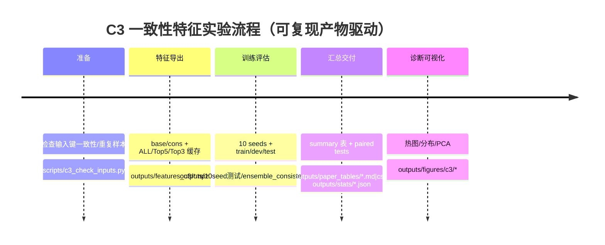

# C3 提示词输出间一致性特征：作用、意义与完整可复现实验设计

## 执行摘要

C3 的核心思想是：**不要只看“每个 prompt 把 input 改得像不像”**，还要看 **“同一条 input 在不同 prompts 下的改写结果彼此像不像、差异有多大”**。这种“多 prompt 内部一致性/分歧”的统计量（均值、方差、pairwise 相似度）往往能提供额外信息：它能解释并缓解你在 C2 中观察到的现象——例如某些域（Arxiv）减少 prompts 会损失“互补性”，而 C3 通过显式引入“分歧结构”使模型不必依赖某几个 prompt 的偶然强势，从而提升**稳健性**（降低 seed 波动）与**可迁移性**。C3 不需要任何新 LLM 调用，仅基于现有重写 JSON 即可完成，并且产物（JSON/CSV/MD/PNG/SVG）可直接进入论文与复现包。

---

## C3 的直观动机与理论意义

**直观动机（面向非 NLP 专家）**  
把同一段文字交给 7 个“编辑”（7 个 prompts）改写：  
- 如果这些编辑给出的改写**都很像**（高度一致），说明这段文字在“改写空间”里很受约束，或者改写器在不同提示下会“收敛”到相似表达。  
- 如果这些编辑给出的改写**差异很大**（分歧大），说明改写空间更自由，提示词对改写的影响更大。

关键是：**这种“一致/分歧”的模式本身，可能在人类文本与模型文本之间不同**。C3 就是把这种模式量化成特征，让检测器学习。

**为什么一致性能帮助检测与稳健性（两层意义）**  
- **检测信息增量**：传统做法（C1/C2）主要衡量 `input ↔ rewrite` 的相似度/编辑距离；C3 额外衡量 `rewrite ↔ rewrite` 的一致性。即使每个 prompt 的改写都“差不多像 input”，不同 prompts 之间是否仍然很像，会提供额外信号。  
- **稳健性增量**：当你减少 prompts（Top-3/Top-5）时，模型更容易“赌”到某些 prompts 的偏好；而 C3 的一致性统计是**跨 prompts 的聚合信号**，有助于降低对单 prompt 的依赖，从而降低 seed 的波动（std）。  
- 从实现角度看，C3 依赖的字符串相似度函数（如 `token_set_ratio`）本身就被设计为对“多余词、词序变化”更鲁棒：RapidFuzz 文档明确说明 `token_set_ratio` 输出范围为 0–100，并在一串是另一串子集时可返回 100（只在显式分歧时下降）。这非常适合衡量“改写是否只是增删/改写部分词”。citeturn0search0  
- `difflib.SequenceMatcher.ratio()` 的相似度在 [0,1]，并给出计算公式与“参数顺序可能影响结果”的注意事项；因此我们在脚本里会做**对称化处理**以更稳健。citeturn0search5  

---

## 具体特征清单与计算方式

下面给出一个“可落地、可解释、范围明确”的特征集合。你可以把它理解为：对每条样本，我们把 K 个 prompt 的输出看成一个集合 \(R=\{r_1,\dots,r_K\}\)，原文为 \(x\)。

### 相似度函数选择

- **Token-set 相似度**（推荐 RapidFuzz）：  
  `tsr(a,b) = fuzz.token_set_ratio(a,b)`，返回 **0–100** 的浮点分数。citeturn0search0  
  使用时归一化：`tsr01 = tsr/100`。
- **字符级相似度**（Python 标准库，无额外依赖）：  
  `csr(a,b) = SequenceMatcher(None,a,b).ratio()`，返回 **[0,1]**。citeturn0search5  
  注意：文档提示 `ratio()` 可能受参数顺序影响，因此我们用对称化：  
  `csr_sym(a,b) = 0.5*(csr(a,b)+csr(b,a))`，减少偶然偏差。citeturn0search5  

若 `rapidfuzz` 不可用，我们脚本会自动 fallback 到 `fuzzywuzzy`；再不行就用一个非常简化的 token set Jaccard（会在风险章节说明局限）。

### 特征列表（定义、范围、含义）

为满足你要求的三大类：`input↔rewrite`、`prompt↔prompt`、`change variance`，再加元特征：

| 组别 | 特征名 | 定义/伪代码 | 取值范围 | 直观含义 |
|---|---|---|---|---|
| input↔rewrite | `mean_tsr_in` | mean\_k tsr01(x,rk) | [0,1] | 平均“改写像原文”的程度（越高越保守） |
| input↔rewrite | `std_tsr_in` | std\_k tsr01(x,rk) | [0,1] | 不同 prompts 对原文改写力度差异 |
| input↔rewrite | `mean_csr_in` | mean\_k csr\_sym(x,rk) | [0,1] | 字符级相似度均值（补充 token-set） |
| input↔rewrite | `std_csr_in` | std\_k csr\_sym(x,rk) | [0,1] | 字符级相似度的分歧 |
| prompt↔prompt | `mean_tsr_pp` | mean\_{i<j} tsr01(ri,rj) | [0,1] | 不同 prompts 输出彼此相似度（越高越一致） |
| prompt↔prompt | `std_tsr_pp` | std\_{i<j} tsr01(ri,rj) | [0,1] | prompts 输出彼此相似度的波动（越高越分歧） |
| prompt↔prompt | `mean_csr_pp` | mean\_{i<j} csr\_sym(ri,rj) | [0,1] | 字符级的一致性 |
| prompt↔prompt | `std_csr_pp` | std\_{i<j} csr\_sym(ri,rj) | [0,1] | 字符级的一致性波动 |
| change | `mean_change` | mean\_k (1 - tsr01(x,rk)) | [0,1] | 平均改写幅度（越高越激进） |
| change | `var_change` | var\_k (1 - tsr01(x,rk)) | [0,1] | 各 prompt 改写幅度分歧（C3 的关键） |
| 元特征 | `len_words` | word\_count(x) / 1000 | ~[0,1] | 长文本与短文本的改写/一致性模式可能不同 |
| 元特征 | `punct_ratio` | punct\_count(x)/char\_len(x) | [0,1] | 标点密度；话语风格/代码风格差异 |
| 元特征 | `digit_ratio` | digit\_count(x)/char\_len(x) | [0,1] | 数字密度；代码/论文/评论不同 |
| 元特征 | `code_symbol_ratio` | code\_sym\_count/char\_len | [0,1] | 对 Code 域尤有用（括号/分号/等号等） |

**伪代码（单样本）**  
```text
keys = prompts_in_item
outs = [item[k] for k in keys]
tsr_in = [tsr01(x, r) for r in outs]
csr_in = [csr_sym(x, r) for r in outs]
tsr_pp = [tsr01(ri, rj) for i<j]
csr_pp = [csr_sym(ri, rj) for i<j]
change = [1 - v for v in tsr_in]

features = [
  mean(tsr_in), std(tsr_in),
  mean(csr_in), std(csr_in),
  mean(tsr_pp), std(tsr_pp),
  mean(csr_pp), std(csr_pp),
  mean(change), var(change),
  meta(x)
]
```

---

## 完整实验设计与可直接执行的脚本+命令

### 数据与文件路径（项目内）

项目根目录：  
`E:\jnu\Final_thesis\实验\Raidar\RaidarLLMDetect`

输入（重写 JSON，含多个 prompt 字段）：

- **Arxiv**  
  - repo：`.\Arxiv\rewrite_arxiv_GPT_inv.json` / `.\Arxiv\rewrite_arxiv_human_inv.json`  
  - deepseek：`.\Arxiv\rewrite_arxiv_GPT_inv_deepseek_350.json` / `.\Arxiv\rewrite_arxiv_human_inv_deepseek_350.json`
- **Code**  
  - repo：`.\Code\rewrite_code_gpt_inv.json` / `.\Code\rewrite_code_human_inv.json`  
  - deepseek：`.\Code\rewrite_code_GPT_inv_deepseek_164.json` / `.\Code\rewrite_code_human_inv_deepseek_164.json`（如你文件名大小写不同，请按实际改）
- **Yelp**  
  - repo：`.\Yelp\rewrite_yelp_gpt_inv.json` / `.\Yelp\rewrite_yelp_human_inv.json`  
  - deepseek：`.\Yelp\rewrite_yelp_gpt_inv_deepseek_401.json` / `.\Yelp\rewrite_yelp_human_inv_deepseek_401.json`

对比组（与 C2 一致）：  
- **ALL**：不传 `keep_keys_json`，使用所有 prompt key  
- **Top-5**：传 `outputs\meta\top5_keys_{domain}_{rewriter}.json`  
- **Top-3**：传 `outputs\meta\top3_keys_{domain}_{rewriter}.json`  

特征模式（C3 的核心对照）：  
- `mode=base`：只用 input↔rewrite + 元特征  
- `mode=cons`：在 base 基础上追加 prompt↔prompt + change variance（一致性特征）

训练器：  
- `StandardScaler`：对每个特征做标准化 \(z=(x-u)/s\)，并强调训练集统计量用于 transform。citeturn1search3  
- `LogisticRegression(class_weight='balanced')`：balanced 会按类频率自动加权 \(n\_samples/(n\_classes*\text{bincount}(y))\)。citeturn1search0  

训练/评估协议：  
- seed-wise 10 seeds：seed_start=42，num_seeds=10  
- 分割：train/dev/test 三段（默认 test=0.2、dev=0.2）使用 `train_test_split` 的 `random_state` 固定随机性；`train_test_split` 文档说明 `random_state` 控制洗牌并保证可复现。citeturn3search1  
- dev 用于选择正则化强度 C（从 C_grid 中挑 dev F1 最佳）  
- test 报 Acc/F1；汇总 mean±std  
- 统计检验：对每组（同域同 rewiter 同 K）比较 `cons - base` 的 10-seed 列表：  
  - paired t-test（相关样本均值差）citeturn0search2  
  - Wilcoxon（检验差值分布是否以 0 为对称中心；非参数配对 t-test）citeturn3search0  
  - bootstrap(BCa) 95%CI（SciPy 文档说明 BCa 等方法差别与流程）citeturn2search0  

输出目录约定：  
- 特征缓存：`outputs\features_c3\...`（NPZ + spec.json）  
- 结果 JSON：`outputs\10seed测试\ensemble_consistency\...json`  
- 总表：`outputs\paper_tables\stageC3_consistency_summary.csv/.md`  
- 统计：`outputs\stats\stageC3_paired_base_vs_cons.json` + `outputs\paper_tables\stageC3_paired_base_vs_cons.md`  
- 图：`outputs\figures\c3\*.png/.svg`

### 脚本一：特征库 `scripts/c3_feature_lib.py`

将下面内容保存为：`.\scripts\c3_feature_lib.py`

```python
# scripts/c3_feature_lib.py
# -*- coding: utf-8 -*-
import re
import string
from itertools import combinations
from difflib import SequenceMatcher

import numpy as np

# ---- similarity backends ----
def _load_token_set_ratio():
    # Prefer RapidFuzz (fast) 0..100 float
    try:
        from rapidfuzz import fuzz
        return lambda a, b: float(fuzz.token_set_ratio(a, b))
    except Exception:
        pass
    # Fallback to fuzzywuzzy (slower) 0..100 int
    try:
        from fuzzywuzzy import fuzz
        return lambda a, b: float(fuzz.token_set_ratio(a, b))
    except Exception:
        pass

    # Last resort: token Jaccard * 100 (approx; NOT equivalent to token_set_ratio)
    def jaccard_token_set(a, b):
        ta = set(re.findall(r"\w+", a.lower()))
        tb = set(re.findall(r"\w+", b.lower()))
        if not ta and not tb:
            return 100.0
        if not ta or not tb:
            return 0.0
        return 100.0 * (len(ta & tb) / len(ta | tb))
    return jaccard_token_set

TOKEN_SET_RATIO = _load_token_set_ratio()

def csr(a: str, b: str) -> float:
    # ratio in [0,1]
    return SequenceMatcher(None, a, b).ratio()

def csr_sym(a: str, b: str) -> float:
    # Python docs caution that ratio() may depend on arg order
    # We symmetrize to reduce this effect.
    return 0.5 * (csr(a, b) + csr(b, a))

def tsr01(a: str, b: str) -> float:
    # token_set_ratio in [0,100] -> [0,1]
    return TOKEN_SET_RATIO(a, b) / 100.0

# ---- meta feature helpers ----
PUNCT = set(string.punctuation) | set("，。！？；：「」『』（）【】《》、…—·")
CODE_SYMS = set("{}[]()<>;:=+-*/\\|&^%$#@!`~")

def meta_features(text: str):
    s = text or ""
    n = max(1, len(s))
    words = s.split()
    len_words = len(words)

    punct_ratio = sum((c in PUNCT) for c in s) / n
    digit_ratio = sum(c.isdigit() for c in s) / n
    upper_ratio = sum(c.isupper() for c in s) / n
    code_ratio = sum((c in CODE_SYMS) for c in s) / n

    # length scaled; other ratios already [0,1]
    return {
        "len_words": len_words / 1000.0,
        "punct_ratio": punct_ratio,
        "digit_ratio": digit_ratio,
        "upper_ratio": upper_ratio,
        "code_symbol_ratio": code_ratio,
    }

# ---- feature definitions ----
FEATURE_BASE = [
    "mean_tsr_in", "std_tsr_in",
    "mean_csr_in", "std_csr_in",
    "mean_change", "var_change",
    "len_words", "punct_ratio", "digit_ratio", "upper_ratio", "code_symbol_ratio",
    "num_prompts",
]
FEATURE_CONS_EXTRA = [
    "mean_tsr_pp", "std_tsr_pp",
    "mean_csr_pp", "std_csr_pp",
]

def get_prompt_keys(item: dict, keep_keys=None):
    keys = [k for k in item.keys() if k not in ("input", "_idx")]
    if keep_keys is not None:
        ks = set(keep_keys)
        keys = [k for k in keys if k in ks]
    return keys

def mean_std(arr):
    arr = np.asarray(arr, dtype=np.float32)
    if arr.size == 0:
        return 0.0, 0.0
    if arr.size == 1:
        return float(arr[0]), 0.0
    return float(arr.mean()), float(arr.std(ddof=1))

def extract_features(item: dict, mode: str = "base", keep_keys=None):
    x = str(item.get("input", "") or "")
    keys = get_prompt_keys(item, keep_keys=keep_keys)
    outs = [str(item.get(k, "") or "") for k in keys]

    # input↔rewrite
    tsr_in = [tsr01(x, r) for r in outs]
    csr_in = [csr_sym(x, r) for r in outs]
    mean_tsr_in, std_tsr_in = mean_std(tsr_in)
    mean_csr_in, std_csr_in = mean_std(csr_in)

    change = [1.0 - v for v in tsr_in]  # in [0,1]
    mean_change = float(np.mean(change)) if len(change) else 0.0
    var_change = float(np.var(change)) if len(change) else 0.0

    mf = meta_features(x)
    num_prompts = len(outs) / 10.0  # scaled

    base_vec = np.array([
        mean_tsr_in, std_tsr_in,
        mean_csr_in, std_csr_in,
        mean_change, var_change,
        mf["len_words"], mf["punct_ratio"], mf["digit_ratio"], mf["upper_ratio"], mf["code_symbol_ratio"],
        num_prompts,
    ], dtype=np.float32)

    if mode == "base":
        return base_vec

    # prompt↔prompt
    tsr_pp = []
    csr_pp = []
    for a, b in combinations(outs, 2):
        tsr_pp.append(tsr01(a, b))
        csr_pp.append(csr_sym(a, b))
    mean_tsr_pp, std_tsr_pp = mean_std(tsr_pp)
    mean_csr_pp, std_csr_pp = mean_std(csr_pp)

    cons_vec = np.array([mean_tsr_pp, std_tsr_pp, mean_csr_pp, std_csr_pp], dtype=np.float32)
    return np.concatenate([base_vec, cons_vec], axis=0)

def feature_names(mode: str):
    if mode == "base":
        return FEATURE_BASE
    return FEATURE_BASE + FEATURE_CONS_EXTRA
```

说明：  
- RapidFuzz 的 `token_set_ratio` 返回 0–100，并对包含关系给出 100 的性质非常适合改写场景。citeturn0search0  
- `SequenceMatcher.ratio` 范围 [0,1]，并有“顺序可能影响结果”的警告，因此我们对称化。citeturn0search5  

### 脚本二：导出特征缓存 `scripts/c3_export_features.py`

保存为：`.\scripts\c3_export_features.py`

```python
# scripts/c3_export_features.py
# -*- coding: utf-8 -*-
import argparse, json, os
from pathlib import Path

import numpy as np

from c3_feature_lib import extract_features, feature_names, get_prompt_keys

def load_json(p):
    with open(p, "r", encoding="utf-8") as f:
        return json.load(f)

def save_json(obj, p):
    Path(p).parent.mkdir(parents=True, exist_ok=True)
    with open(p, "w", encoding="utf-8") as f:
        json.dump(obj, f, ensure_ascii=False, indent=2)

def load_keep_keys(p):
    if not p:
        return None
    j = load_json(p)
    if isinstance(j, list):
        return j
    return j.get("keys") or j.get("prompt_keys") or j.get("keep_keys")

def dedupe_by_input(items):
    seen = set()
    out = []
    for it in items:
        x = str(it.get("input",""))
        if x in seen:
            continue
        seen.add(x)
        out.append(it)
    return out

def main():
    ap = argparse.ArgumentParser()
    ap.add_argument("--gpt_json", required=True)
    ap.add_argument("--human_json", required=True)
    ap.add_argument("--out_npz", required=True)
    ap.add_argument("--out_spec", required=True)
    ap.add_argument("--mode", choices=["base","cons"], default="cons")
    ap.add_argument("--keep_keys_json", default="")
    ap.add_argument("--max_idx", type=int, default=-1, help="use 0..max_idx; -1 means full length")
    ap.add_argument("--dedupe", action="store_true")
    ap.add_argument("--overwrite", action="store_true")
    args = ap.parse_args()

    if (not args.overwrite) and os.path.exists(args.out_npz):
        print("[skip] exists:", args.out_npz)
        return

    g = load_json(args.gpt_json)
    h = load_json(args.human_json)

    if args.dedupe:
        g = dedupe_by_input(g)
        h = dedupe_by_input(h)

    if args.max_idx >= 0:
        g = g[: args.max_idx + 1]
        h = h[: args.max_idx + 1]

    keep_keys = load_keep_keys(args.keep_keys_json)

    # Safety: ensure keys present in both sides
    g0 = set(get_prompt_keys(g[0], keep_keys=None))
    h0 = set(get_prompt_keys(h[0], keep_keys=None))
    inter = sorted(list(g0 & h0))
    if keep_keys is None:
        use_keys = inter
    else:
        use_keys = [k for k in keep_keys if k in g0 and k in h0]

    if len(use_keys) == 0:
        raise RuntimeError("No usable prompt keys after intersection/filtering. Check keep_keys_json or input files.")

    Xg = np.vstack([extract_features(it, mode=args.mode, keep_keys=use_keys) for it in g]).astype(np.float32)
    Xh = np.vstack([extract_features(it, mode=args.mode, keep_keys=use_keys) for it in h]).astype(np.float32)

    Path(args.out_npz).parent.mkdir(parents=True, exist_ok=True)
    np.savez_compressed(args.out_npz, Xg=Xg, Xh=Xh)  # compressed NPZ

    spec = {
        "inputs": {"gpt_json": args.gpt_json, "human_json": args.human_json},
        "mode": args.mode,
        "keep_keys_json": args.keep_keys_json,
        "keys_used": use_keys,
        "num_prompts_used": len(use_keys),
        "num_samples_gpt": int(Xg.shape[0]),
        "num_samples_human": int(Xh.shape[0]),
        "feature_dim": int(Xg.shape[1]),
        "feature_names": feature_names(args.mode),
        "notes": [
            "Xg rows correspond to GPT samples, Xh rows correspond to human samples.",
            "NPZ is saved via numpy.savez_compressed."
        ],
    }
    save_json(spec, args.out_spec)

    print("saved:", args.out_npz)
    print("saved:", args.out_spec)

if __name__ == "__main__":
    main()
```

`np.savez_compressed` 用于把多个数组压缩保存到单个 `.npz`，文档明确其行为与参数。citeturn4search1  

### 脚本三：训练评估 `scripts/c3_train_eval.py`

保存为：`.\scripts\c3_train_eval.py`

```python
# scripts/c3_train_eval.py
# -*- coding: utf-8 -*-
import argparse, json, os
from pathlib import Path

import numpy as np
from scipy import stats
from sklearn.model_selection import train_test_split
from sklearn.preprocessing import StandardScaler
from sklearn.linear_model import LogisticRegression
from sklearn.metrics import accuracy_score, f1_score

def load_npz(path):
    npz = np.load(path)
    return npz["Xg"], npz["Xh"]

def save_json(obj, path):
    Path(path).parent.mkdir(parents=True, exist_ok=True)
    with open(path, "w", encoding="utf-8") as f:
        json.dump(obj, f, ensure_ascii=False, indent=2)

def parse_C_grid(s):
    return [float(x.strip()) for x in s.split(",") if x.strip()]

def fit_eval_once(X, y, seed, test_ratio, dev_ratio, C_grid):
    # train/test split (stratified)
    X_tr, X_te, y_tr, y_te = train_test_split(
        X, y, test_size=test_ratio, random_state=seed, shuffle=True, stratify=y
    )

    # train/dev split from train portion
    dev_from_train = dev_ratio / max(1e-9, (1.0 - test_ratio))
    X_tr2, X_dev, y_tr2, y_dev = train_test_split(
        X_tr, y_tr, test_size=dev_from_train, random_state=seed, shuffle=True, stratify=y_tr
    )

    scaler = StandardScaler()
    X_tr2_s = scaler.fit_transform(X_tr2)
    X_dev_s = scaler.transform(X_dev)
    X_te_s  = scaler.transform(X_te)

    best = None
    for C in C_grid:
        clf = LogisticRegression(
            max_iter=3000,
            class_weight="balanced",
            C=C,
            random_state=seed
        )
        clf.fit(X_tr2_s, y_tr2)
        pred_dev = clf.predict(X_dev_s)
        f1 = f1_score(y_dev, pred_dev)
        if (best is None) or (f1 > best["f1"]) or (f1 == best["f1"] and C < best["C"]):
            best = {"C": C, "f1": float(f1)}

    # refit on train+dev with best C
    X_tr_all = np.concatenate([X_tr2, X_dev], axis=0)
    y_tr_all = np.concatenate([y_tr2, y_dev], axis=0)

    scaler2 = StandardScaler()
    X_tr_all_s = scaler2.fit_transform(X_tr_all)
    X_te_s2 = scaler2.transform(X_te)

    clf2 = LogisticRegression(
        max_iter=3000,
        class_weight="balanced",
        C=best["C"],
        random_state=seed
    )
    clf2.fit(X_tr_all_s, y_tr_all)
    pred = clf2.predict(X_te_s2)

    acc = float(accuracy_score(y_te, pred))
    f1  = float(f1_score(y_te, pred))
    return acc, f1, best["C"]

def main():
    ap = argparse.ArgumentParser()
    ap.add_argument("--npz", required=True)
    ap.add_argument("--out_json", required=True)
    ap.add_argument("--seed_start", type=int, default=42)
    ap.add_argument("--num_seeds", type=int, default=10)
    ap.add_argument("--test_ratio", type=float, default=0.2)
    ap.add_argument("--dev_ratio", type=float, default=0.2)
    ap.add_argument("--C_grid", default="0.1,1,10")
    ap.add_argument("--tag", default="")
    args = ap.parse_args()

    Xg, Xh = load_npz(args.npz)
    yg = np.ones((Xg.shape[0],), dtype=np.int64)
    yh = np.zeros((Xh.shape[0],), dtype=np.int64)

    X = np.concatenate([Xh, Xg], axis=0)
    y = np.concatenate([yh, yg], axis=0)

    C_grid = parse_C_grid(args.C_grid)

    seeds = list(range(args.seed_start, args.seed_start + args.num_seeds))
    acc_list, f1_list, C_list = [], [], []
    for s in seeds:
        acc, f1, C = fit_eval_once(X, y, s, args.test_ratio, args.dev_ratio, C_grid)
        acc_list.append(acc); f1_list.append(f1); C_list.append(C)
        print(f"[seed={s}] acc={acc:.4f} f1={f1:.4f} C={C}")

    ms = {
        "seeds": seeds,
        "multi_seeds": args.num_seeds,
        "acc_list": acc_list,
        "f1_list": f1_list,
        "acc_mean": float(np.mean(acc_list)),
        "acc_std": float(np.std(acc_list, ddof=1)) if len(acc_list)>1 else 0.0,
        "f1_mean": float(np.mean(f1_list)),
        "f1_std": float(np.std(f1_list, ddof=1)) if len(f1_list)>1 else 0.0,
        "C_list": C_list,
    }

    out = {
        "tag": args.tag,
        "npz": args.npz,
        "config": {
            "seed_start": args.seed_start,
            "num_seeds": args.num_seeds,
            "test_ratio": args.test_ratio,
            "dev_ratio": args.dev_ratio,
            "C_grid": C_grid,
            "model": "LogisticRegression(class_weight='balanced') + StandardScaler",
        },
        "multi_seed_summary": ms,
    }

    save_json(out, args.out_json)
    print("saved:", args.out_json)

if __name__ == "__main__":
    main()
```

说明：  
- `train_test_split` 的 `random_state` 用于可复现的随机划分。citeturn3search1  
- StandardScaler 的公式与“尺度不一致会让某些特征主导目标函数”的解释在文档里非常清楚，这是 C3 必须用 StandardScaler 的原因之一。citeturn1search3  
- LogisticRegression 的 `class_weight='balanced'` 会按类频率分配权重，文档给出具体形式。citeturn1search0  

### 脚本四：汇总报表与主图 `scripts/c3_collect_report.py`

保存为：`.\scripts\c3_collect_report.py`

```python
# scripts/c3_collect_report.py
# -*- coding: utf-8 -*-
import argparse, json, os, re
from pathlib import Path

import numpy as np
import pandas as pd
import matplotlib.pyplot as plt

def load_ms(p):
    j = json.load(open(p, "r", encoding="utf-8"))
    ms = j["multi_seed_summary"]
    return ms

def fmt(m,s):
    return f"{m:.4f} ± {s:.4f}"

def parse_name(fn):
    # pattern: <domain>_<rewriter>_<setting>_<mode>.json
    m = re.match(r"([a-z]+)_([a-z]+)_(all|top5|top3)_(base|cons)\.json$", fn.lower())
    if not m:
        return None
    return m.group(1), m.group(2), m.group(3), m.group(4)

def main():
    ap = argparse.ArgumentParser()
    ap.add_argument("--in_dir", required=True)
    ap.add_argument("--out_csv", required=True)
    ap.add_argument("--out_md", required=True)
    ap.add_argument("--out_fig_prefix", required=True)
    args = ap.parse_args()

    rows=[]
    for p in sorted(Path(args.in_dir).glob("*.json")):
        parsed = parse_name(p.name)
        if not parsed:
            continue
        dom, rw, setting, mode = parsed
        ms = load_ms(str(p))
        rows.append({
            "Domain": dom.capitalize(),
            "Rewriter": rw,
            "Setting": setting.upper(),
            "Mode": mode.upper(),
            "Accuracy(mean±std)": fmt(ms["acc_mean"], ms["acc_std"]),
            "F1(mean±std)": fmt(ms["f1_mean"], ms["f1_std"]),
            "Path": str(p),
        })
    df = pd.DataFrame(rows).sort_values(["Domain","Rewriter","Setting","Mode"]).reset_index(drop=True)

    Path(args.out_csv).parent.mkdir(parents=True, exist_ok=True)
    df.to_csv(args.out_csv, index=False, encoding="utf-8-sig")

    # markdown
    pipe = chr(124)
    md=[]
    md.append("# Stage C3 Summary: base vs cons (consistency features)")
    md.append("")
    md.append(f"{pipe} Domain {pipe} Rewriter {pipe} Setting {pipe} Mode {pipe} Accuracy (mean±std) {pipe} F1 (mean±std) {pipe}")
    md.append(f"{pipe}---{pipe}---{pipe}---{pipe}---{pipe}---:{pipe}---:{pipe}")
    for rec in df.to_dict("records"):
        md.append(f"{pipe} {rec['Domain']} {pipe} {rec['Rewriter']} {pipe} {rec['Setting']} {pipe} {rec['Mode']} {pipe} {rec['Accuracy(mean±std)']} {pipe} {rec['F1(mean±std)']} {pipe}")
    Path(args.out_md).parent.mkdir(parents=True, exist_ok=True)
    open(args.out_md, "w", encoding="utf-8").write("\n".join(md))

    # figure: F1 bars for each (domain, rewriter, setting), base vs cons
    def parse_ms(s):
        a=str(s).split("±")
        return float(a[0].strip()), float(a[1].strip())

    df2=df.copy()
    df2[["f1_mean","f1_std"]] = df2["F1(mean±std)"].apply(lambda x: pd.Series(parse_ms(x)))

    plt.figure()
    groups = df2[["Domain","Rewriter","Setting"]].drop_duplicates().reset_index(drop=True)
    x = np.arange(len(groups))
    w = 0.35

    for j, mode in enumerate(["BASE","CONS"]):
        sub = df2[df2["Mode"]==mode].merge(groups, on=["Domain","Rewriter","Setting"], how="right")
        m = sub["f1_mean"].values
        e = sub["f1_std"].values
        xpos = x + (j-0.5)*w
        plt.bar(xpos, m, width=w, label=mode)
        plt.errorbar(xpos, m, yerr=e, fmt="none", capsize=3)

    labels = [f"{r.Domain}-{r.Rewriter}-{r.Setting}" for r in groups.itertuples(index=False)]
    plt.xticks(x, labels, rotation=60, ha="right")
    plt.ylabel("F1")
    plt.legend()
    plt.tight_layout()
    plt.savefig(args.out_fig_prefix + "_f1.png", dpi=300)
    plt.savefig(args.out_fig_prefix + "_f1.svg")
    plt.close()

    print("saved:", args.out_csv)
    print("saved:", args.out_md)
    print("saved figs:", args.out_fig_prefix + "_f1.(png|svg)")

if __name__ == "__main__":
    main()
```

### 脚本五：配对统计检验 `scripts/c3_paired_tests.py`

保存为：`.\scripts\c3_paired_tests.py`

```python
# scripts/c3_paired_tests.py
# -*- coding: utf-8 -*-
import argparse, json, os, re
from pathlib import Path
import numpy as np
from scipy import stats

def load_ms(p):
    j=json.load(open(p,"r",encoding="utf-8"))
    return j["multi_seed_summary"]

def paired_report(a, b):
    # diff = b - a
    a=np.array(a,float); b=np.array(b,float)
    d=b-a
    tt=stats.ttest_rel(b,a,alternative="two-sided")
    ww=stats.wilcoxon(b,a,alternative="two-sided",zero_method="wilcox",method="auto")
    boot=stats.bootstrap((d,), np.mean, confidence_level=0.95, n_resamples=20000, method="BCa", random_state=0)
    sd=float(np.std(d,ddof=1)) if len(d)>1 else 0.0
    dz=float(np.mean(d)/sd) if sd>0 else float("nan")
    return {
        "diff_mean": float(np.mean(d)),
        "diff_std": sd,
        "ttest_p": float(tt.pvalue),
        "wilcoxon_p": float(ww.pvalue),
        "cohen_dz": dz,
        "ci95": {"low": float(boot.confidence_interval.low), "high": float(boot.confidence_interval.high)},
    }

def parse_name(fn):
    m=re.match(r"([a-z]+)_([a-z]+)_(all|top5|top3)_(base|cons)\.json$", fn.lower())
    if not m: return None
    return m.group(1), m.group(2), m.group(3), m.group(4)

def main():
    ap=argparse.ArgumentParser()
    ap.add_argument("--in_dir", required=True)
    ap.add_argument("--out_json", required=True)
    ap.add_argument("--out_md", required=True)
    args=ap.parse_args()

    files = sorted(Path(args.in_dir).glob("*.json"))
    # index by group key
    idx={}
    for p in files:
        pr=parse_name(p.name)
        if not pr: 
            continue
        dom,rw,setting,mode=pr
        idx.setdefault((dom,rw,setting),{})[mode]=str(p)

    out={"meta":{"compare":"CONS - BASE","tests":["paired t-test","wilcoxon","bootstrap BCa 95%"]},"groups":{}}
    pipe=chr(124)
    md=[]
    md.append("# Stage C3 Paired Tests: CONS minus BASE")
    md.append("")
    md.append("说明：差值定义为 CONS - BASE；paired t-test 检验配对均值差；Wilcoxon 为非参数配对检验；CI 为 bootstrap(BCa) 95%。")
    md.append("")
    md.append(f"{pipe} Group {pipe} Metric {pipe} mean(diff) {pipe} t p {pipe} wilcoxon p {pipe} dz {pipe} CI95 low {pipe} CI95 high {pipe}")
    md.append(f"{pipe}---{pipe}---:{pipe}---:{pipe}---:{pipe}---:{pipe}---:{pipe}---:{pipe}---:{pipe}")

    for g,mm in idx.items():
        if "base" not in mm or "cons" not in mm:
            continue
        ms_a=load_ms(mm["base"])
        ms_b=load_ms(mm["cons"])
        if ms_a["seeds"]!=ms_b["seeds"]:
            raise RuntimeError(f"seed mismatch for {g}")
        r_acc=paired_report(ms_a["acc_list"], ms_b["acc_list"])
        r_f1 =paired_report(ms_a["f1_list"],  ms_b["f1_list"])
        key=f"{g[0]}/{g[1]}/{g[2]}".upper()
        out["groups"][key]={"paths":{"base":mm["base"],"cons":mm["cons"]},"acc":r_acc,"f1":r_f1}
        for metric,res in [("acc",r_acc),("f1",r_f1)]:
            md.append(f"{pipe} {key} {pipe} {metric} {pipe} {res['diff_mean']:.4f} {pipe} {res['ttest_p']:.4g} {pipe} {res['wilcoxon_p']:.4g} {pipe} {res['cohen_dz']:.3f} {pipe} {res['ci95']['low']:.4f} {pipe} {res['ci95']['high']:.4f} {pipe}")

    Path(args.out_json).parent.mkdir(parents=True, exist_ok=True)
    json.dump(out, open(args.out_json,"w",encoding="utf-8"), ensure_ascii=False, indent=2)
    Path(args.out_md).parent.mkdir(parents=True, exist_ok=True)
    open(args.out_md,"w",encoding="utf-8").write("\n".join(md))
    print("saved:", args.out_json)
    print("saved:", args.out_md)

if __name__=="__main__":
    main()
```

统计方法依据：  
- paired t-test：检验两组相关样本均值是否相同。citeturn0search2  
- Wilcoxon：检验差值分布是否以 0 为对称中心，为配对 t-test 的非参数版本；并给出 statistic 的定义。citeturn3search0  
- bootstrap(BCa)：SciPy 文档明确 percentile/basic/BCa 的差别与流程。citeturn2search0  

### C3 运行命令（PowerShell，全部是脚本调用，无 python -c）

下面先给一个“建议先跑通”的配置：**Arxiv-deepseek / ALL + TOP5 + TOP3 / base vs cons**。跑通后再扩展到三域两重写器。

#### 创建目录
```powershell
cd "E:\jnu\Final_thesis\实验\Raidar\RaidarLLMDetect"
New-Item -ItemType Directory -Force .\outputs\features_c3, .\outputs\10seed测试\ensemble_consistency, .\outputs\paper_tables, .\outputs\figures\c3, .\outputs\stats | Out-Null
```

#### Arxiv-deepseek：导出特征（ALL / TOP5 / TOP3；base 与 cons）
```powershell
# ALL - base/cons
python .\scripts\c3_export_features.py --gpt_json ".\Arxiv\rewrite_arxiv_GPT_inv_deepseek_350.json" --human_json ".\Arxiv\rewrite_arxiv_human_inv_deepseek_350.json" --mode base --out_npz ".\outputs\features_c3\arxiv_deepseek_all_base.npz" --out_spec ".\outputs\features_c3\arxiv_deepseek_all_base_spec.json" --max_idx 349 --overwrite
python .\scripts\c3_export_features.py --gpt_json ".\Arxiv\rewrite_arxiv_GPT_inv_deepseek_350.json" --human_json ".\Arxiv\rewrite_arxiv_human_inv_deepseek_350.json" --mode cons --out_npz ".\outputs\features_c3\arxiv_deepseek_all_cons.npz" --out_spec ".\outputs\features_c3\arxiv_deepseek_all_cons_spec.json" --max_idx 349 --overwrite

# TOP5 - base/cons
python .\scripts\c3_export_features.py --gpt_json ".\Arxiv\rewrite_arxiv_GPT_inv_deepseek_350.json" --human_json ".\Arxiv\rewrite_arxiv_human_inv_deepseek_350.json" --keep_keys_json ".\outputs\meta\top5_keys_arxiv_deepseek.json" --mode base --out_npz ".\outputs\features_c3\arxiv_deepseek_top5_base.npz" --out_spec ".\outputs\features_c3\arxiv_deepseek_top5_base_spec.json" --max_idx 349 --overwrite
python .\scripts\c3_export_features.py --gpt_json ".\Arxiv\rewrite_arxiv_GPT_inv_deepseek_350.json" --human_json ".\Arxiv\rewrite_arxiv_human_inv_deepseek_350.json" --keep_keys_json ".\outputs\meta\top5_keys_arxiv_deepseek.json" --mode cons --out_npz ".\outputs\features_c3\arxiv_deepseek_top5_cons.npz" --out_spec ".\outputs\features_c3\arxiv_deepseek_top5_cons_spec.json" --max_idx 349 --overwrite

# TOP3 - base/cons
python .\scripts\c3_export_features.py --gpt_json ".\Arxiv\rewrite_arxiv_GPT_inv_deepseek_350.json" --human_json ".\Arxiv\rewrite_arxiv_human_inv_deepseek_350.json" --keep_keys_json ".\outputs\meta\top3_keys_arxiv_deepseek.json" --mode base --out_npz ".\outputs\features_c3\arxiv_deepseek_top3_base.npz" --out_spec ".\outputs\features_c3\arxiv_deepseek_top3_base_spec.json" --max_idx 349 --overwrite
python .\scripts\c3_export_features.py --gpt_json ".\Arxiv\rewrite_arxiv_GPT_inv_deepseek_350.json" --human_json ".\Arxiv\rewrite_arxiv_human_inv_deepseek_350.json" --keep_keys_json ".\outputs\meta\top3_keys_arxiv_deepseek.json" --mode cons --out_npz ".\outputs\features_c3\arxiv_deepseek_top3_cons.npz" --out_spec ".\outputs\features_c3\arxiv_deepseek_top3_cons_spec.json" --max_idx 349 --overwrite
```

#### Arxiv-deepseek：训练评估（10 seeds）
```powershell
python .\scripts\c3_train_eval.py --npz ".\outputs\features_c3\arxiv_deepseek_all_base.npz"  --out_json ".\outputs\10seed测试\ensemble_consistency\arxiv_deepseek_all_base.json"  --seed_start 42 --num_seeds 10 --test_ratio 0.2 --dev_ratio 0.2 --C_grid "0.1,1,10" --tag "arxiv_deepseek_all_base"
python .\scripts\c3_train_eval.py --npz ".\outputs\features_c3\arxiv_deepseek_all_cons.npz"  --out_json ".\outputs\10seed测试\ensemble_consistency\arxiv_deepseek_all_cons.json"  --seed_start 42 --num_seeds 10 --test_ratio 0.2 --dev_ratio 0.2 --C_grid "0.1,1,10" --tag "arxiv_deepseek_all_cons"

python .\scripts\c3_train_eval.py --npz ".\outputs\features_c3\arxiv_deepseek_top5_base.npz" --out_json ".\outputs\10seed测试\ensemble_consistency\arxiv_deepseek_top5_base.json" --seed_start 42 --num_seeds 10 --test_ratio 0.2 --dev_ratio 0.2 --C_grid "0.1,1,10" --tag "arxiv_deepseek_top5_base"
python .\scripts\c3_train_eval.py --npz ".\outputs\features_c3\arxiv_deepseek_top5_cons.npz" --out_json ".\outputs\10seed测试\ensemble_consistency\arxiv_deepseek_top5_cons.json" --seed_start 42 --num_seeds 10 --test_ratio 0.2 --dev_ratio 0.2 --C_grid "0.1,1,10" --tag "arxiv_deepseek_top5_cons"

python .\scripts\c3_train_eval.py --npz ".\outputs\features_c3\arxiv_deepseek_top3_base.npz" --out_json ".\outputs\10seed测试\ensemble_consistency\arxiv_deepseek_top3_base.json" --seed_start 42 --num_seeds 10 --test_ratio 0.2 --dev_ratio 0.2 --C_grid "0.1,1,10" --tag "arxiv_deepseek_top3_base"
python .\scripts\c3_train_eval.py --npz ".\outputs\features_c3\arxiv_deepseek_top3_cons.npz" --out_json ".\outputs\10seed测试\ensemble_consistency\arxiv_deepseek_top3_cons.json" --seed_start 42 --num_seeds 10 --test_ratio 0.2 --dev_ratio 0.2 --C_grid "0.1,1,10" --tag "arxiv_deepseek_top3_cons"
```

#### 汇总报表 + 主图 + 配对检验（完成论文级交付）
```powershell
python .\scripts\c3_collect_report.py --in_dir ".\outputs\10seed测试\ensemble_consistency" --out_csv ".\outputs\paper_tables\stageC3_consistency_summary.csv" --out_md ".\outputs\paper_tables\stageC3_consistency_summary.md" --out_fig_prefix ".\outputs\figures\c3\fig_stageC3_consistency"

python .\scripts\c3_paired_tests.py --in_dir ".\outputs\10seed测试\ensemble_consistency" --out_json ".\outputs\stats\stageC3_paired_base_vs_cons.json" --out_md ".\outputs\paper_tables\stageC3_paired_base_vs_cons.md"
```

---

## 诊断与可视化：一致性热图、change 分布、PCA 2D

C3 不只要“跑分”，还要能解释“为什么有效/无效”。建议至少出 3 张图：

- **一致性热图**：prompt↔prompt 平均相似度矩阵（分别对 human 与 gpt）  
- **change 分布图**：每条样本的平均 change（1-相似度）在人类 vs GPT 上的分布  
- **PCA 2D**：把特征矩阵投影到二维，看两类是否更可分（提示：PCA 输入会被中心化但不缩放，因此先 StandardScaler）citeturn2search6turn1search3  

### 脚本六：诊断绘图 `scripts/c3_diagnostics.py`

保存为：`.\scripts\c3_diagnostics.py`

```python
# scripts/c3_diagnostics.py
# -*- coding: utf-8 -*-
import argparse, json, os
from pathlib import Path
import numpy as np
import matplotlib.pyplot as plt

from c3_feature_lib import tsr01, csr_sym, get_prompt_keys
from sklearn.preprocessing import StandardScaler
from sklearn.decomposition import PCA

def load_json(p):
    return json.load(open(p, "r", encoding="utf-8"))

def load_keep_keys(p):
    if not p:
        return None
    j = load_json(p)
    if isinstance(j, list):
        return j
    return j.get("keys") or j.get("prompt_keys") or j.get("keep_keys")

def heatmap(mat, labels, out_png, out_svg, title):
    # Try seaborn first; fallback to imshow
    try:
        import seaborn as sns
        plt.figure()
        sns.heatmap(mat, xticklabels=labels, yticklabels=labels, square=True)
        plt.title(title)
        plt.tight_layout()
    except Exception:
        plt.figure()
        plt.imshow(mat, aspect="equal")
        plt.colorbar()
        plt.xticks(range(len(labels)), labels, rotation=60, ha="right")
        plt.yticks(range(len(labels)), labels)
        plt.title(title)
        plt.tight_layout()

    Path(out_png).parent.mkdir(parents=True, exist_ok=True)
    plt.savefig(out_png, dpi=300)
    plt.savefig(out_svg)
    plt.close()

def main():
    ap = argparse.ArgumentParser()
    ap.add_argument("--gpt_json", required=True)
    ap.add_argument("--human_json", required=True)
    ap.add_argument("--keep_keys_json", default="")
    ap.add_argument("--max_samples", type=int, default=200)
    ap.add_argument("--npz_for_pca", default="", help="optional: exported NPZ for PCA scatter")
    ap.add_argument("--out_dir", required=True)
    args = ap.parse_args()

    Path(args.out_dir).mkdir(parents=True, exist_ok=True)

    g = load_json(args.gpt_json)[:args.max_samples]
    h = load_json(args.human_json)[:args.max_samples]
    keep = load_keep_keys(args.keep_keys_json)

    # Prompt keys order
    keys = get_prompt_keys(g[0], keep_keys=keep)
    K = len(keys)
    if K < 2:
        print("[warn] less than 2 prompts, heatmap skipped.")
        return

    # Build mean pairwise tsr matrix for GPT and Human
    def avg_matrix(data):
        M = np.zeros((K, K), dtype=np.float32)
        C = np.zeros((K, K), dtype=np.int32)
        for it in data:
            outs = [str(it.get(k, "") or "") for k in keys]
            for i in range(K):
                for j in range(K):
                    if i == j:
                        M[i, j] += 1.0
                        C[i, j] += 1
                    else:
                        M[i, j] += tsr01(outs[i], outs[j])
                        C[i, j] += 1
        return M / np.maximum(C, 1)

    Mg = avg_matrix(g)
    Mh = avg_matrix(h)

    heatmap(Mg, [f"P{i+1}" for i in range(K)],
            os.path.join(args.out_dir, "heatmap_prompt_prompt_gpt.png"),
            os.path.join(args.out_dir, "heatmap_prompt_prompt_gpt.svg"),
            "Prompt↔Prompt mean similarity (GPT)")
    heatmap(Mh, [f"P{i+1}" for i in range(K)],
            os.path.join(args.out_dir, "heatmap_prompt_prompt_human.png"),
            os.path.join(args.out_dir, "heatmap_prompt_prompt_human.svg"),
            "Prompt↔Prompt mean similarity (Human)")

    # Change distribution: mean(1 - tsr01(input, out))
    def mean_change(data):
        out=[]
        for it in data:
            x=str(it.get("input","") or "")
            outs=[str(it.get(k,"") or "") for k in keys]
            ch=[1.0 - tsr01(x,r) for r in outs]
            out.append(float(np.mean(ch)) if ch else 0.0)
        return np.array(out, dtype=np.float32)

    cg = mean_change(g)
    ch = mean_change(h)

    plt.figure()
    plt.hist(ch, bins=20, alpha=0.6, label="human")
    plt.hist(cg, bins=20, alpha=0.6, label="gpt")
    plt.xlabel("mean change = mean(1 - token_set_sim(input, rewrite))")
    plt.ylabel("count")
    plt.legend()
    plt.tight_layout()
    plt.savefig(os.path.join(args.out_dir, "hist_mean_change.png"), dpi=300)
    plt.savefig(os.path.join(args.out_dir, "hist_mean_change.svg"))
    plt.close()

    # PCA (optional)
    if args.npz_for_pca:
        npz = np.load(args.npz_for_pca)
        Xg = npz["Xg"]; Xh = npz["Xh"]
        y = np.concatenate([np.zeros(Xh.shape[0]), np.ones(Xg.shape[0])], axis=0)
        X = np.concatenate([Xh, Xg], axis=0)

        scaler = StandardScaler()
        Xs = scaler.fit_transform(X)
        pca = PCA(n_components=2, random_state=0)
        Z = pca.fit_transform(Xs)

        plt.figure()
        plt.scatter(Z[y==0,0], Z[y==0,1], s=10, alpha=0.6, label="human")
        plt.scatter(Z[y==1,0], Z[y==1,1], s=10, alpha=0.6, label="gpt")
        plt.xlabel("PC1"); plt.ylabel("PC2")
        plt.legend()
        plt.tight_layout()
        plt.savefig(os.path.join(args.out_dir, "pca_2d.png"), dpi=300)
        plt.savefig(os.path.join(args.out_dir, "pca_2d.svg"))
        plt.close()

    print("saved diagnostics to:", args.out_dir)

if __name__ == "__main__":
    main()
```

热图实现说明：  
- `seaborn.heatmap` 的功能与参数在文档里描述为“将矩阵数据绘成颜色编码矩阵”。citeturn5search4  
- 若不用 seaborn，我们 fallback 到 `matplotlib.pyplot.imshow`（显示二维栅格图像）。citeturn5search2  

运行示例（以 Arxiv-deepseek / ALL 为例）：  
```powershell
New-Item -ItemType Directory -Force .\outputs\figures\c3\diagnostics_arxiv_deepseek_all | Out-Null
python .\scripts\c3_diagnostics.py --gpt_json ".\Arxiv\rewrite_arxiv_GPT_inv_deepseek_350.json" --human_json ".\Arxiv\rewrite_arxiv_human_inv_deepseek_350.json" --out_dir ".\outputs\figures\c3\diagnostics_arxiv_deepseek_all" --max_samples 200 --npz_for_pca ".\outputs\features_c3\arxiv_deepseek_all_cons.npz"
```

---

## 结果解读指南与论文表述模板

### 如何判断“一致性特征是否有用”

你主要看三件事（同域同 rewiter 同 K，比较 `CONS - BASE`）：

1) **均值差（diff_mean）**：`diff_mean > 0` 表示一致性特征提升（越大越好）。  
2) **95%CI 是否跨 0**：如果 CI 的 low/high 都在 0 上方，说明提升更稳健；CI 的解释可引用 bootstrap 输出为置信区间，SciPy 文档给出 BCa 等方法。citeturn2search0  
3) **配对检验 p 值**：paired t-test 与 Wilcoxon 都显著，说明结论对分布假设更不敏感；Wilcoxon 的“差值分布关于 0 对称”的原假设在文档中明确。citeturn3search0  

**建议的报告规则（不强行用固定阈值）**  
- “有效”：diff_mean 为正，CI 多数不跨 0，同时至少一个检验（t 或 Wilcoxon）显著。  
- “部分有效”：diff_mean 为正但 CI 跨 0（提示样本/seed 可能不足或收益小）；可作为趋势。  
- “无效”：diff_mean 接近 0 或为负，且 CI 明显跨 0。

### 写论文的模板（两种情形）

**如果有效（示例模板）**  
> 在相同 prompts 子集与相同训练器条件下，我们在 base 特征（input↔rewrite 相似度统计）基础上加入一致性特征（prompt↔prompt pairwise 相似度与 change variance）。一致性特征在 {domain}/{rewriter}/{K} 设置下实现平均 F1 提升 Δ=diff_mean（95% bootstrap CI [low, high]），并在配对检验（paired t-test / Wilcoxon）下保持显著/一致趋势，表明多提示词输出的“一致/分歧结构”包含可用于区分人类/模型文本的附加信息。citeturn0search2turn3search0turn2search0  

**如果无效（示例模板）**  
> 加入一致性特征后，F1 的平均差值接近 0 且 bootstrap CI 跨 0，说明在当前数据与重写器条件下，prompt↔prompt 的一致性统计未提供稳定增益。我们推测原因包括：改写器在多 prompts 下输出已高度收敛（热图显示相似度整体偏高）或子集 prompts 数量不足以稳定估计一致性方差。因此后续采用路由策略按域选择 prompts 数量/子集，而不是依赖一致性特征单独补偿。

---

## 风险与缓解：检查命令与修复片段

### 风险：特征维度不一致（最常见）
**原因**：GPT/Human 两份重写 JSON 的 prompt keys 不一致，或 keep_keys_json 里有不存在的 key。  
**缓解**：`c3_export_features.py` 已默认取 keys 交集；若交集为空会直接报错。  
**检查脚本（建议）**：保存为 `scripts/c3_check_inputs.py`

```python
# scripts/c3_check_inputs.py
import argparse, json
def keys_of(p):
    x=json.load(open(p,"r",encoding="utf-8"))[0]
    return set([k for k in x.keys() if k not in ("input","_idx")])
def main():
    ap=argparse.ArgumentParser()
    ap.add_argument("--gpt_json", required=True)
    ap.add_argument("--human_json", required=True)
    args=ap.parse_args()
    kg=keys_of(args.gpt_json); kh=keys_of(args.human_json)
    print("gpt keys:", len(kg))
    print("human keys:", len(kh))
    print("only in gpt:", sorted(list(kg-kh)))
    print("only in human:", sorted(list(kh-kg)))
    print("intersection:", len(kg&kh))
if __name__=="__main__":
    main()
```

运行：  
```powershell
python .\scripts\c3_check_inputs.py --gpt_json ".\Arxiv\rewrite_arxiv_GPT_inv_deepseek_350.json" --human_json ".\Arxiv\rewrite_arxiv_human_inv_deepseek_350.json"
```

### 风险：重复样本（例如 Arxiv input 重复）
**影响**：一致性统计和 train/dev/test 划分的独立性变弱。  
**缓解**：`c3_export_features.py` 提供 `--dedupe`，可对照“去重 vs 不去重”。

### 风险：计算成本（O(N·K²)）
**缓解**：C3 设计为“先导出特征缓存再训练”，不会每个 seed 重复计算；缓存采用 npz 压缩写盘。citeturn4search1  

### 风险：相似度函数鲁棒性
- token_set_ratio 在包含关系时容易给 100，可能导致饱和；但 RapidFuzz 文档也说明只有显式分歧才下降，这正是它鲁棒的原因之一。citeturn0search0  
- SequenceMatcher ratio 可能受参数顺序影响，脚本已对称化；此风险来自 Python 文档的注意事项。citeturn0search5  

---

## 一键运行顺序与任务表

### 推荐的一键命令序列（4 条，完成 C3 核心交付）

1) **导出特征（先 Arxiv-deepseek ALL/TOP5/TOP3 的 base+cons）**  
2) **训练评估（10 seeds）**  
3) **汇总报表+主图**  
4) **配对检验 + 诊断图**

为了让你真的“一键”，建议你把上面命令按域写进一个 PS 脚本（例如 `scripts/run_c3_arxiv_deepseek.ps1`），然后执行：

```powershell
powershell -ExecutionPolicy Bypass -File .\scripts\run_c3_arxiv_deepseek.ps1
python .\scripts\c3_collect_report.py --in_dir ".\outputs\10seed测试\ensemble_consistency" --out_csv ".\outputs\paper_tables\stageC3_consistency_summary.csv" --out_md ".\outputs\paper_tables\stageC3_consistency_summary.md" --out_fig_prefix ".\outputs\figures\c3\fig_stageC3_consistency"
python .\scripts\c3_paired_tests.py --in_dir ".\outputs\10seed测试\ensemble_consistency" --out_json ".\outputs\stats\stageC3_paired_base_vs_cons.json" --out_md ".\outputs\paper_tables\stageC3_paired_base_vs_cons.md"
python .\scripts\c3_diagnostics.py --gpt_json ".\Arxiv\rewrite_arxiv_GPT_inv_deepseek_350.json" --human_json ".\Arxiv\rewrite_arxiv_human_inv_deepseek_350.json" --out_dir ".\outputs\figures\c3\diagnostics_arxiv_deepseek_all" --max_samples 200 --npz_for_pca ".\outputs\features_c3\arxiv_deepseek_all_cons.npz"
```

### 任务—命令—输出—优先级表

| 任务 | 核心命令 | 主要输出 | 优先级 |
|---|---|---|---|
| 特征导出缓存 | `python scripts\c3_export_features.py ...` | `outputs\features_c3\*.npz` + `*_spec.json` | 最高 |
| 训练评估 | `python scripts\c3_train_eval.py ...` | `outputs\10seed测试\ensemble_consistency\*.json` | 最高 |
| 汇总表+主图 | `python scripts\c3_collect_report.py ...` | `outputs\paper_tables\stageC3_consistency_summary.*` + `outputs\figures\c3\fig_stageC3_consistency_*` | 高 |
| 配对统计检验 | `python scripts\c3_paired_tests.py ...` | `outputs\stats\stageC3_paired_base_vs_cons.json` + `outputs\paper_tables\*.md` | 高 |
| 诊断图 | `python scripts\c3_diagnostics.py ...` | `outputs\figures\c3\diagnostics_*/` | 中 |

### Mermaid 时间线（展示 C3 步骤）



---

### 扩展到三域两重写器的建议

你现在已经完成 C2 的 K 选择实验，并观察到 **Arxiv 的 K 敏感性很强**；因此 C3 最优先跑 **Arxiv-deepseek**（ALL vs TOP5/TOP3），看一致性特征能否“解释或改善”子集掉分。确认可行后，再扩展到 Code/Yelp（尤其 Yelp 的 std 降得明显，C3 很可能进一步解释）。