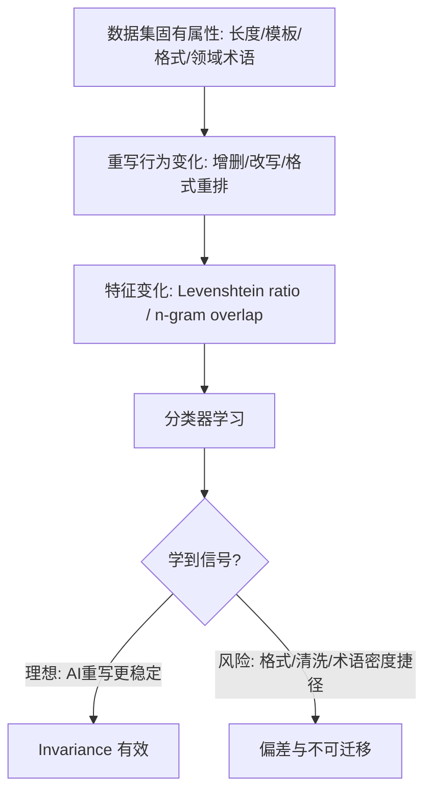

# Raidar 复现实验数据集偏差风险分析与替代推荐报告

执行摘要：我梳理了该复现论文用于对比 Raidar 的 7 个数据集，逐一分析其长度、体裁、结构化字段、领域术语与敏感内容等“特殊性”如何扭曲单次重写 Invariance 基线（编辑距离 / 长度归一化 / n-gram overlap）并诱发分类器捷径。随后我检索并评估 6 个更通用的替代数据集，最终强烈推荐以 **SQuAD 上下文段落**与 **CC-News（按段落采样）**作为更稳的 baseline 载体。

## 背景与我关注的单次重写 Invariance 基线

我这里的“Raidar 单次重写 Invariance 基线”，指的是：对输入文本 **只调用一次黑盒 LLM 进行重写**，然后用重写前后差异来做判别特征。Raidar 明确把这种“重写后改动大小差异”作为核心假设：LLM 重写时往往会更少修改它认为“高质量”的文本，因此 AI 文本相对更“稳定”，人类文本更容易被改动。citeturn14view1turn12view1

在特征层面，我关心的就是 Raidar 在论文中明确写出的两类符号级特征：  
一类是 **bag-of-words edit**：统计输入与重写输出之间“共有 n-words”的数量，并用输入长度归一化；另一类是 **Levenshtein（编辑距离）归一化相似度**：用 \(1-\frac{Levenshtein(s_k,x)}{\max(len(s_k),len(x))}\) 做长度无关化。citeturn15view1turn15view2

这也解释了我为什么特别在意“数据集特殊性/偏差风险”：一旦数据集自带极端长度、固定模板、强结构化字段、或大量噪声格式（链接、列表、代码块），就会直接影响编辑距离与 n-gram overlap 的统计规律，让分类器学到“体裁/格式/清洗程度”这类捷径，而不是学到“AI 与 human 的重写稳定性差异”。citeturn15view1turn15view2

## 复现论文的数据集清单与整体风险画像

我把“该复现论文”视为 D&R（Disrupt-and-Recover）这篇工作：它在实验中把 RAIDAR 作为最强 baseline 之一进行对比，并说明其评估是“paragraph-level AI-generated text detection”。citeturn5view0turn3view0

这篇论文在设置里写“使用六个公开数据集”，但随后实际列出了 **4 个 long-text + 3 个 short-text（共 7 个）**：ML-ArXiv-Papers、CNN-DailyMail、IMDB、ROCStories、Wikihow、AG-News、Reddit。citeturn5view0turn21view0  
它还给出长度分组规则：long texts（>800 words）与 short texts（<350 words），并在 Figure 5 展示各数据集平均长度分布。citeturn5view0turn21view0

同时，这篇论文说明其构造方式是：对每个数据集抽样 1000 条人类文本作为负类，再用不同源模型的“paraphrasing prompts”生成长度可比的 AI 对照文本，形成平衡的 parallel 数据。citeturn5view0turn21view0  
这一步本身就引入一个很重要的“生成器捷径风险”：AI 文本是“被要求做 paraphrase/改写”的产物，而不是自然写作或开放式生成；它往往更规整、更像“二次编辑后的文本”。这会放大 Raidar 所依赖的“重写时改动更少”的信号，但也可能偏离真实场景（例如 AI 从零写作、或人类也经过润色）。citeturn5view0turn14view1

## 各数据集特殊性与对单次重写 Invariance 基线的影响

下面我按数据集逐个给出“特殊性/偏差风险 → 对编辑距离/归一化/n-gram overlap 的影响 → 分类器可能学到的捷径”。其中我会优先引用 D&R 论文对数据集的定义与其对 RAIDAR 的结果表。

**ML-ArXiv-Papers（机器学习论文摘要）**  
特殊性：写作风格正式、结构严谨、术语密集（学术写作体裁强约束）。citeturn21view0  
对 Raidar 的影响：  
1）术语密集会使 n-gram overlap 偏高：学术摘要大量固定短语（“we propose…”，“experimental results show…”），重写往往倾向保留术语与名词短语，从而抬高 overlap、降低编辑差异；这可能让“术语密度/模板句”成为捷径。citeturn15view1turn21view0  
2）长文本（该复现论文把其分到 >800 words 的 long-text 组）意味着即便做长度归一化，编辑距离仍可能出现“局部改写—全局稳定”的稀释效应：大段不动、小段修饰，归一化后差异变小，模型可能依赖其他线索（例如标点与引用格式）。citeturn5view0turn15view2turn21view0  
复现论文中 RAIDAR 的表现：ML-ArXiv-Papers 上 RAIDAR 平均 AUROC 0.8611±0.0472（四个 long-text 数据集之一）。citeturn3view0turn3view2  
额外风险（源模型≠变换模型）：RAIDAR 在该数据集上 src=trx 时 0.9475，src≠trx 时 0.8611（下降 9.1%）。这提示“重写器/生成器不一致”会显著改变稳定性分布，本身就是偏差源。citeturn4view0

**CNN-DailyMail（新闻文章）**  
特殊性：新闻体裁信息密集、叙事连贯、含大量事实陈述，常作为新闻摘要/生成基准。citeturn21view0turn16search8  
对 Raidar 的影响：  
1）新闻“倒金字塔结构”导致头段高度模板化：重写器可能主要改写句式与连接词，但保留事实实体与时间地点（命名实体集中），从而使 n-gram overlap 与编辑距离更受“命名实体密度”影响，分类器可能学到“实体保留率/数字比例”，而不是 AI 稳定性。citeturn15view1turn21view0  
2）新闻文章较长：即便用 \(\max(len)\) 归一化，长文下编辑距离的方差更小，容易出现“高 AUROC 但解释性弱”的情况（因为许多无关差异被平均掉）。citeturn15view2turn21view0  
复现论文中 RAIDAR 的表现：CNN-DailyMail 上 RAIDAR 平均 AUROC 0.8471±0.0759。citeturn3view0turn3view2  
同样存在 src≠trx 下降更明显：0.9875 → 0.8471（下降 14.2%），显示新闻域对“生成器/重写器一致性”更敏感，可能因为新闻写作更模板化、模型分布差异更容易被放大。citeturn4view0

**IMDB（电影评论）**  
特殊性：强主观、情绪极性强、口语化与个性风格明显。citeturn21view0turn17search0turn17search14  
对 Raidar 的影响（典型偏差高发区）：  
1）人类影评常包含拼写错误、口语缩写、感叹号堆叠；重写器会“纠错+润色”，导致人类文本重写改动显著增大，而 AI 文本（若源自 LLM）本来就更规范，改动更小。此时分类器学到的可能是“是否脏/是否口语”，而不是真实 AI 痕迹。citeturn21view0turn15view1  
2）情绪词与夸张表达在重写时可能被“中和”，使编辑距离更多反映“情绪强度”而不是生成来源。citeturn21view0turn15view2  
复现论文中 RAIDAR 的表现：IMDB 上 RAIDAR 平均 AUROC 0.8675±0.0552。citeturn3view0turn3view2  
src≠trx 也有明显下降：0.9675 → 0.8675（下降 10.3%）。citeturn4view0

**ROCStories（五句常识故事）**  
特殊性：固定为“五句话故事”，情节日常、因果链清晰，是典型的“短叙事模板”。citeturn21view0turn18search3  
对 Raidar 的影响：  
1）句子数量近乎固定，会让模型学到“叙事模板一致性”而不是 AI 稳定性：重写器倾向保留事件顺序（人类与 AI 都保留），于是 n-gram overlap 的差异可能很小，编辑距离受少量词替换影响更大、波动更大。citeturn15view1turn15view2turn21view0  
2）短文本下“离散特征不稳定”更明显：改 1 个词就能造成 Levenshtein ratio 明显变化；这与 D&R 对短文本困难性的解释一致（有限上下文导致 human/AI 分布更重叠）。citeturn3view2turn21view0  
复现论文中 RAIDAR 的表现：ROCStories 上 RAIDAR 平均 AUROC 0.9323±0.0482（在 long-text 表里报告）。citeturn3view0turn3view2  
这里我会额外提醒一个“口径风险”：ROCStories 在原始论文中本质是五句短故事（更接近短文本）。如果把它按“长文本”来叙事呈现，很容易让 baseline 的“长文本有效”结论看起来更强，但实际上可能混入了短叙事模板的特殊性。citeturn18search3turn21view0

**Wikihow（How-to 指南）**  
特殊性：步骤式、编号式、命令句居多，结构高度规则（step-by-step）。citeturn21view0  
对 Raidar 的影响：  
1）结构化格式会主导编辑距离：重写器把“Step 1/2/3”变成自然段、或合并/拆分句子，会造成大量插入/删除与标点变化；此时编辑距离更多衡量“格式重排”而不是质量偏好。citeturn15view2turn21view0  
2）如果 AI 对照文本来源于“paraphrasing prompts”，它可能天然更像“说明书式规整语句”，重写器进一步改动更少，导致捷径：模型学习到“说明文规范程度”。citeturn5view0turn21view0  
复现论文中 RAIDAR 的表现（短文本表）：在不同源模型下 RAIDAR AUROC 从 0.5300（Qwen-Turbo）到 0.7800（GPT2）不等。citeturn3view1turn4view0  
此外，wikiHow 数据在公开分发上还存在现实可用性风险：entity["company","Hugging Face","machine learning platform"] 的法律库中出现过关于 wikiHow 内容版权的 DMCA 下架通知，这意味着“直接用现成镜像数据集”可能会遇到不可复现或合规问题。citeturn20search22turn20search1

**AG-News（新闻标题+短描述）**  
特殊性：高度压缩的短新闻文本（headline + short description），天然很短。citeturn21view0turn18search10  
对 Raidar 的影响：  
1）极短文本会让 length-normalized Levenshtein 变得“过于敏感”：改动几个 token 即可导致相似度显著下降/上升，使特征方差增大、边界不稳。citeturn15view2turn21view0  
2）标题/短描述的固定新闻写法会让 n-gram overlap 更依赖“实体与专名”，容易产生“实体密度捷径”。citeturn15view1turn21view0  
复现论文中 RAIDAR 的表现：例如在 AG-News 上，RAIDAR 在 Qwen-Turbo 下 AUROC 0.6850，在 GPT4.1 下 0.6735，但在 GPT-Neo-2.7B 下 0.7524，波动明显。citeturn4view0turn6view4  
另外，有文献对 AG News 的统计给出“平均每条记录约 39 words”的量级，这与其短文本定位一致。citeturn18search17turn18search10

**Reddit（帖子标题+摘要/正文片段）**  
特殊性：口语化、风格极多样、结构不规则（社交媒体文本），可能含链接、俚语、脏话与敏感话题。citeturn21view0turn0search3  
对 Raidar 的影响：  
1）重写器往往会“去口语化/去脏话/去链接化”，导致人类文本编辑距离变大；而 AI 文本若更规整，则改动更小 → 仍然可能走向“文本清洗程度捷径”。citeturn21view0turn15view2  
2）社交媒体中人类与 AI 的界线本就更模糊，且短文本上下文不足会放大 overlap。D&R 也强调短文本更难，且 RAIDAR 在 source–transformation mismatch 下更不稳。citeturn3view2turn4view0turn21view0  
复现论文中 RAIDAR 的表现：在 Reddit 上 RAIDAR 在 GPT4.1 下 AUROC 0.7429，在 Grok3 下 0.7800，整体中等偏高但仍受源模型影响。citeturn4view0turn6view4

## 元数据表与长度分布图

说明：平均长度若非论文给出明确数字，我按其 Figure 5 柱状图读数做“估计”。论文把阈值写成 “>800 words / <350 words”，因此我也以 **words** 理解长度单位。citeturn5view0turn21view0

### 数据集元数据表

| 数据集名 | 来源链接 | 典型文本单位 | 平均长度（词） | 领域 | 潜在问题（1–2条） |
|---|---|---|---:|---|---|
| ML-ArXiv-Papers | D&R 数据集说明citeturn21view0；HF 数据卡citeturn0search2 | abstract / long paragraph | ≈1109（估计）citeturn21view0 | 学术（ML） | 术语密集、模板句多；长文稀释重写差异 |
| CNN-DailyMail | D&R 数据集说明citeturn21view0；原始论文citeturn16search8 | document / long paragraph | ≈1154（估计）citeturn21view0 | 新闻 | 实体/数字主导 overlap；src≠trx 时 RAIDAR 下降大citeturn4view0 |
| IMDB | D&R 数据集说明citeturn21view0；原始论文citeturn17search0 | review（document） | ≈929（估计）citeturn21view0 | 评论/情绪 | 错别字与口语导致润色差异捷径；情绪强度主导编辑距离 |
| ROCStories | D&R 数据集说明citeturn21view0；原始论文citeturn18search3 | five-sentence story | ≈835（估计）citeturn21view0 | 叙事/常识 | 五句模板强约束；短文本特征高方差 |
| Wikihow | D&R 数据集说明citeturn21view0；版权/可用性提示citeturn20search22 | instruction steps / paragraph | ≈197（估计）citeturn21view0 | 指南/说明文 | step 格式主导编辑距离；存在版权分发不确定性 |
| AG-News | D&R 数据集说明citeturn21view0；TFDS 说明citeturn18search10 | headline+short desc（sentence） | ≈239（估计）citeturn21view0 | 新闻短文本 | 极短导致归一化编辑距离不稳；实体密度捷径 |
| Reddit (title-body) | D&R 数据集说明citeturn21view0；HF 数据卡citeturn0search3 | short post | ≈345（估计）citeturn21view0 | 社交媒体 | 敏感/脏话/链接多；风格噪声与清洗捷径 |

### 估计平均长度的可视化

（“█”长度仅表示相对大小，不是精确比例；数值来自对 Figure 5 柱状图读数的估计。）citeturn21view0

- CNN-DailyMail ≈1154 ██████████████████████  
- ML-ArXiv-Papers ≈1109 █████████████████████  
- IMDB ≈929 █████████████████  
- ROCStories ≈835 ███████████████  
- Reddit ≈345 ███████  
- AG-News ≈239 █████  
- Wikihow ≈197 ████  

## 更通用且不“特殊”的 6 个候选替代数据集与评分

我这里的“更通用且不特殊”，我的判据是：  
长度更容易裁剪到 150–400 words 的段落区间、文本结构不过度模板化、字段不过度格式化、公开可下载且复现稳定，以及敏感/版权风险更可控。

我筛选的 6 个候选替代集如下（并按你要求的 5 个维度 1–5 打分：越高越好；敏感性是“风险越低分越高”）。

| 候选数据集 | 可用性（公开/易下载） | 长度适中性（段落级） | 风格多样性 | 可控生成（易做 AI 配对） | 伦理/敏感风险（低风险高分） | 简短理由 |
|---|---:|---:|---:|---:|---:|---|
| SQuAD 1.1（只取 context 段落） | 5citeturn22search0turn22search8 | 5citeturn22search0 | 4citeturn22search0 | 4citeturn22search0 | 4citeturn22search0 | Wikipedia 段落天然适合“段落级检测”；可用文章标题/首句做 prompt 生成对照 |
| Wikipedia（清洗版全文章，再按段落采样） | 5citeturn23search15 | 4citeturn23search15 | 4citeturn23search15 | 3citeturn23search15 | 4citeturn23search15 | 覆盖面广、结构相对规范；需要我自己做“段落抽取+长度过滤” |
| CC-News（标题-正文对，按段落采样） | 4citeturn22search10 | 4citeturn22search10 | 3citeturn22search10 | 5citeturn22search10 | 3citeturn22search10 | 标题字段天然可控生成；新闻体裁接近现实，但可能含暴力事件等敏感内容 |
| BookCorpusOpen（小说段落采样） | 4citeturn22search3 | 3citeturn22search3 | 4citeturn22search3 | 3citeturn22search3 | 3citeturn22search3 | 叙事风格多样但长文较多，需要我严格截断；内容可能包含成人/暴力情节 |
| Project Gutenberg（公共领域书籍，段落采样） | 4citeturn23search8turn23search4 | 3citeturn23search8 | 3citeturn23search8 | 2citeturn23search8 | 3citeturn23search8 | 可用性强、许可清晰；但语言年代感重、可能含历史歧视性表述，需要过滤 |
| C4（Common Crawl 清洗语料，抽取段落） | 4citeturn23search1turn23search2 | 4citeturn23search1 | 5citeturn23search1 | 2citeturn23search1 | 2citeturn23search1 | 覆盖极广但“网页噪声/潜在有害内容/可能混入 AI 文本”风险更高，且缺少可控元信息 |

我补充一句：之所以我把 “可控生成”单列为维度，是因为 D&R 的实验构造里也强调了“生成 AI 对照文本要与人类长度可比并保持平衡”。如果候选集缺少标题/问题等元信息，我在做 AI 配对时就更容易把“生成提示模板”变成新的捷径偏差来源。citeturn5view0turn21view0

## 最终强烈推荐与最小成本落地建议

### 我的首选数据集

我强烈推荐用于 **Raidar 单次重写 Invariance baseline** 的首选是：

**首选 A：SQuAD 1.1（context 段落）**  
理由（对应你关心的“减少捷径 / 利于编辑距离信号 / 对齐论文口径 / 成本与可复现”）：
1）它天然提供 Wikipedia 段落级 context，避免了 AG-News 这种极短文本导致的归一化编辑距离不稳，也避免了 CNN/IMDB 这种超长文把差异“稀释”的问题。citeturn22search0turn15view2  
2）文本结构相对“普通自然段”，不像 wikiHow 的 step-by-step 模板那样会让格式重排主导编辑距离。citeturn21view0turn15view2  
3）可控生成容易：我可以用“Wikipedia 文章标题 + 一句任务描述 + 长度约束”生成 AI 对照段落，减少“paraphrase-from-human”导致的过强信号偏置。citeturn22search0turn5view0  
4）数据公开稳定，能最大化复现性，降低 wikiHow 那类潜在版权/分发不确定性。citeturn22search8turn20search22

**首选 B：CC-News（按段落采样）**  
理由：
1）CC-News 有“标题—正文”结构，标题天然是可控 prompt，使 AI 对照文本更接近真实新闻生成场景，而不是“复写人类文本”的 paraphrase 场景。citeturn22search10turn5view0  
2）我可以只抽取正文中的 150–300 words 段落，避开整篇新闻过长带来的稀释。citeturn15view2turn22search10  
3）它与新闻写作域相关，便于后续把方法迁移到你论文主线里的新闻/摘要任务域（即便最终主评测是别的数据集，新闻域的“普通段落”仍是一个合理的现实场景代理）。citeturn16search8turn22search10

### 我建议的采样与预处理策略

我会把策略写得“可直接变成实验配置文件”，尽量减少新的自由度：

**段落抽取与长度匹配**  
1）对 human 文本：从原文中抽取连续自然段，过滤掉包含明显列表符号（如“Step 1/•/1.”）、大量 URL、代码块、或引用标记的段落；再强制长度在 150–300 words（或 200–350 words）区间。  
2）对 AI 文本：用同样长度区间约束生成；如果生成超长/超短则重试一次，仍不满足则丢弃该样本。这样能降低“长度”成为捷径，即使 Raidar 用了 max(len) 归一化，也避免极短文本的高方差问题。citeturn15view2turn21view0

**AI 配对文本的生成方式（避免 paraphrase 过拟合）**  
我会优先用“元信息驱动生成”，而不是“直接改写 human 原文”：
- SQuAD：用 Wikipedia 页面标题（或从 context 的首句抽取主题名词短语）作为 prompt，让模型生成一段百科风格解释段落；避免把原 context 直接喂给生成器当“改写任务”。citeturn22search0  
- CC-News：用新闻标题生成正文段落；这样 AI 文本与 human 同域同体裁，但不与 human 文本共享逐句内容，减少 n-gram overlap 被“内容重叠”驱动。citeturn22search10turn15view1

**重写提示词与缓存纪律（保证可复现）**  
单次重写 baseline 只固定一个重写提示词（P0），并记录：重写模型、temperature、max_tokens、长度约束策略等，并对每个（text_id, prompt_id, model）缓存重写输出。这样后续做 prompt sensitivity、ensemble、routing 才不会因为重写不可控而成本爆炸。citeturn15view2turn5view0

### 我会如何把“数据集特殊性”写进论文叙事里

我会把这段逻辑直接写成“实验设置合理性”的论证链：

对应证据我会引用：Raidar 明确使用 bag-of-words edit 与长度归一化 Levenshtein ratio 作为特征，并强调“长度无关化”的动机；D&R 的实验则展示在 src≠trx 情况下 RAIDAR 明显掉点，说明“生成器/重写器分布差异”会影响稳定性分布。citeturn15view2turn4view0turn5view0

## 我优先检索与引用的来源清单

我在写作与后续复现实验中，会优先以“原论文 + 权威数据卡/原始论文”为主，必要时再用中文二手资料做补充语境：

- Raidar 原文（方法、特征、长度归一化、提示词示例与数据集覆盖面）：citeturn24search19turn15view1turn15view2  
- 复现/对比论文 D&R（数据集列表、构造方式、长度分组、RAIDAR 的 AUROC、src≠trx 下降幅度、Figure 5 长度分布）：citeturn1view1turn3view0turn4view0turn21view0  
- 数据集原始论文/权威入口：  
  - CNN/DailyMail（Pointer-Generator / ACL）：citeturn16search8  
  - IMDB（Large Movie Review Dataset + Maas et al. ACL 2011）：citeturn17search14turn17search0  
  - ROCStories：citeturn18search3  
  - AG News 规模与说明（TFDS/相关文献统计）：citeturn18search10turn18search17  
  - Reddit title-body（HF 数据卡）：citeturn0search3  
- “替代数据集”来源：  
  - SQuAD：citeturn22search0turn22search8  
  - Wikipedia（清洗版 dump）：citeturn23search15  
  - CC-News：citeturn22search10  
  - BookCorpusOpen：citeturn22search3  
  - Project Gutenberg：citeturn23search8turn23search4  
  - C4 与其来源（allenai/c4 + T5/C4 论文）：citeturn23search1turn23search2  
- 相关方法论文（用于我在论文里解释“重写/语义差异信号”的谱系）：DART（基于 AMR 的 rephrase 检测）：citeturn24search0  
- 提示词工程背景综述（用于我在论文里合理化“prompt 作为控制变量”）：citeturn24search5turn24search9  
- 可用性/合规风险提示（wikiHow 版权与下架不确定性）：citeturn20search22turn20search1