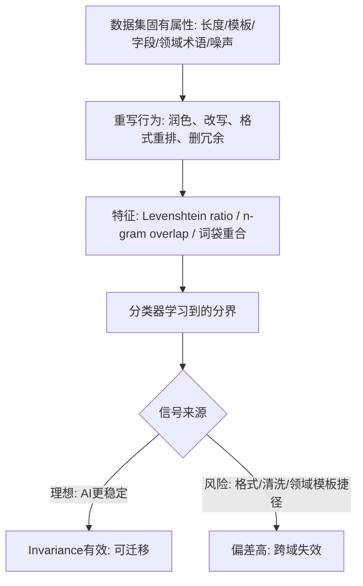

# Raidar 复现实验数据集偏差风险与替代推荐报告

## 执行摘要

我梳理了复现论文 D&R 使用的 7 个数据集，评估其长度、格式与领域特性如何引入“编辑距离/重合度捷径”，并据此筛选 6 个更通用替代集。结论：若目标是稳健跑通 Raidar 的单次重写 Invariance 基线，我优先推荐 **SQuAD 的 Wikipedia 段落（context）**与 **CC‑News（按段落采样）**，并给出可复现的采样、长度匹配与生成 AI 配对文本策略。citeturn10view0turn14view3turn13view0turn19search2turn0search2

## 任务界定与方法敏感点

我需要回答的任务非常明确：**复现论文（D&R）里每个数据集有什么“特殊性/偏差风险”，这些特性会怎样影响 Raidar 的单次重写 Invariance 基线**（编辑距离、长度归一化、n‑gram overlap、分类器学到捷径），并在此基础上给出更通用数据集替代推荐。citeturn10view0turn14view3

在我的口径里，“Raidar 单次重写 Invariance 基线”可以简化成一条链：**输入文本 x → 用同一条重写提示词让黑盒 LLM 重写一次得到 s → 计算字符级编辑差异（Levenshtein ratio）与词袋/ n‑gram 重合度（bag-of-words edit / n‑words overlap）→ 训练轻量分类器判别 human vs AI**。Raidar 在论文中明确写出了：bag‑of‑words edit 用“共有 n‑words 数量 / 输入长度”归一化；Levenshtein 用 \(1-\frac{Levenshtein(s,x)}{\max(len(s),len(x))}\) 归一化，以降低长度影响。citeturn14view3

因此我评估数据集“特殊性”时，重点盯住两类风险：

第一类是**长度与结构主导**：文本极短会让归一化编辑距离高方差（改几个字符就大幅波动），文本极长会让差异被均摊稀释；过强的模板结构（编号步骤、固定句型、标题+短描述）会让编辑距离主要反映“格式重排/清洗”，而不是 Raidar 想捕捉的“AI 文本更稳定、人类文本更易被改写”。citeturn14view3turn6view0turn13view0

第二类是**生成与重写带来的捷径**：如果 AI 对照文本不是“自然生成”，而是由“paraphrasing prompts”从人类文本改写得到，那么 human/AI 之间会多出一层“写作过程差异”（例如 AI 更规范、更接近润色稿），使分类器可能学到“规范度/口语度/错别字率”等捷径；同时 Raidar 也被指出“依赖特定 paraphraser，且对 prompt 层面的操纵敏感”。citeturn11view0turn28view0turn14view0

下面这张流程图是我向导师/审稿人解释“为什么数据集特殊性会直接影响 Raidar 特征”的最简因果链：



（该链条的“特征定义”直接来自 Raidar；而“短文本更难、模型不匹配会掉点”是 D&R 在分析段落里明确指出的现象。）citeturn14view3turn6view0turn4view1

## 复现论文数据集逐一偏差风险与 Raidar 表现

### 复现论文数据集清单与实验构造

我先确认 D&R 的数据集清单：它说“使用六个公开数据集”，但在同一段落中又给出了 **4 个 long‑text + 3 个 short‑text（合计 7 个）**：ML‑ArXiv‑Papers、CNN‑DailyMail、IMDB、ROCStories、Wikihow、AG‑News、Reddit。citeturn11view0turn13view0

它还明确了构造方式：**每个数据集抽样 1,000 条 human 文本作为负类，再用不同 source models 的 paraphrasing prompts 生成“长度可比”的 AI 对照文本，形成 balanced parallel datasets**。citeturn11view0turn6view0 这一步对我很关键：它天然带来“AI‑revised human text”的分布偏置（AI 样本更像润色稿），会系统性强化“重写稳定性差异”，从而可能高估 Raidar 这类 rewriting‑consistency 方法在真实场景（open‑ended generation）下的效果。citeturn11view0turn28view0turn30view0

### Raidar 在 D&R 的关键结果（我会在论文里摘用的数值）

在 long‑text 四域的平均结果里，D&R 报告 RAIDAR 的 AUROC（Mean±SD）为 **0.8770±0.0657**；分数据集分别是：ML‑ArXiv‑Papers **0.8611±0.0472**、CNN‑DailyMail **0.8471±0.0759**、IMDB **0.8675±0.0552**、ROCStories **0.9323±0.0482**。citeturn5view1

在 short‑text 三域表格里，RAIDAR 的 AUROC 受 source model 影响很大：例如 Wikihow 上从 **0.5300（Qwen‑Turbo）**到 **0.7800（GPT2）**，AG‑News 上从 **0.6735（GPT4.1）**到 **0.7776（Gemini2.5‑Flash）**，Reddit 上从 **0.7310（Qwen‑Turbo）**到 **0.7947（GPT‑Neo‑2.7B）**。D&R 还给出 RAIDAR 在短文本设置下的汇总 Mean±SD 为 **0.7248±0.0707**。citeturn4view2

更重要的是“source–transformation mismatch”：D&R 固定 transformation model（trx）为 DeepSeek‑v3，并比较 src=trx 与 src≠trx。RAIDAR 在四个 long‑text 数据集上平均从 **0.9712** 掉到 **0.8792（↓9.4%）**，其中 CNN‑DailyMail 掉幅最大 **↓14.2%**。这说明 rewriting‑consistency 方法的稳定性分布会受“生成器与重写器是否同分布”显著影响，是我评估数据集偏差时必须纳入的核心因素。citeturn4view2turn6view0

### 数据集逐一偏差风险分析

下面我对 D&R 这 7 个数据集逐个做“特殊性/偏差风险 → 对 Raidar 特征的影响 → 可能学到的捷径”的分析。为便于复现对齐，我优先引用 D&R 对数据集性质的原文描述、其长度分布图，以及这些数据集的原始论文/数据卡。citeturn12view0turn13view0turn15search6turn15search1turn15search0turn15search3

#### ML‑ArXiv‑Papers（机器学习论文标题+摘要）

D&R 把它定义为来自 arXiv 的机器学习领域论文摘要，并强调其“专业语言、结构严谨、逻辑连贯”。citeturn12view0turn11view0 但我注意到：Hugging Face 上被 D&R 采用的同名数据集（CShorten/ML‑ArXiv‑Papers）明确写“当前版本只包含 title 和 abstract”。citeturn29view0turn16search2 这意味着该域的“内容单位”是短摘要而不是长论文正文，因此它天然存在两类偏差风险：

一是**领域术语与固定句式**会让 n‑gram overlap 偏高：学术摘要的常见模板短语（例如“we propose…/experimental results…/we show…”，以及固定的技术名词）往往被重写器保留，使 bag‑of‑words 重合度不再主要反映“文本来源”，而混入“术语密度/模板化程度”。这会让分类器学到“学术模板”捷径，而非纯粹的“AI 更稳定”。citeturn14view3turn12view0

二是**引用/符号/公式片段**（即便摘要中也可能出现）容易触发重写器的“格式清洗”行为：例如把括号内缩写、百分号、连字符等规范化。此时编辑距离更像在测“格式清洗强度”。这些现象会放大 src≠trx 时的掉点风险，因为不同重写器对格式与术语的处理风格差异很大，而 D&R 的 mismatch 实验恰好显示 RAIDAR 对 mismatch 明显更敏感。citeturn4view2turn14view3turn12view0

#### CNN‑DailyMail（新闻文章）

D&R 将其作为长文本新闻文章域；新闻数据在原始工作中被广泛用于摘要与生成，并且 CNN/DailyMail 的经典描述明确提到其由在线新闻文章构成。citeturn12view0turn15search6 该域对 Raidar 的关键偏差风险在于：

第一，**命名实体与数字比例**可能成为捷径：新闻段落通常包含大量人名、地名、时间与数字，重写器在“保持事实”约束下往往保留这些 token，因此 n‑gram overlap 会被实体/数字主导，而不是被句法与措辞差异主导。若 AI 对照文本又是由“paraphrasing prompts”生成，实体与数字更可能被严格复制，进一步让 overlap 特征成为“复写程度”探测器。citeturn11view0turn14view3turn27view0

第二，CNN/DailyMail 本身是“摘要‑正文”对齐任务的经典数据；如果复现者不小心拿了 highlights/summary 字段当正文（或混用），会出现严重的“摘要 vs 原文不对称”偏差：摘要更短、更抽象，重写器的编辑距离机制会完全变形。虽然 D&R 文中强调用的是 news articles，但我仍会把“字段混用风险”写进复现风险列表。citeturn11view0turn15search6

在现象层面，CNN‑DailyMail 是 RAIDAR 在 mismatch 下掉点最大的域（↓14.2%），我的解释是：新闻写作的模板与事实约束，使重写器差异更容易被放大为“稳定性差异”，从而对 src≠trx 更敏感。citeturn4view2turn5view1

#### IMDB（电影评论）

IMDB 影评数据的经典描述指出其是大规模用户评论集，并且在构造上强调避免训练/测试共享电影以减少“电影‑词‑标签”的偶然关联。citeturn15search1turn5view1 这类“用户生成文本”对 Raidar 的偏差风险集中在：

第一，**口语/错别字/情绪表达**是重写器最爱“润色”的对象：人类评论常含拼写错误、夸张标点、俚语；重写器一旦按“提升流畅度”工作，就会对 human 做较大修改，而 AI 文本（如果原本由 LLM 生成）更规范、改动更少，从而把“规范度差异”当成来源信号。此时编辑距离测到的是“清洗幅度”，不是 Raidar 想解释的“偏好高质量文本导致少改动”。citeturn12view0turn14view3turn30view0

第二，情绪极性可能驱动编辑差异：重写器会中和过激措辞，使强情绪 human 文本编辑距离变大；分类器可能学到“情绪强度”而非生成来源。对导师/审稿人而言，这属于典型的“风格捷径”。citeturn12view0turn6view0

#### ROCStories（五句常识故事）

ROCStories 的原始论文明确它是“commonsense stories”的五句故事语料，并配套 cloze 测试。citeturn15search0turn12view0 D&R 也把它描述为“five‑sentence stories”，强调其叙事结构与因果关系。citeturn12view0

这个数据集对 Raidar 的特殊性很强：**句数与叙事结构被强约束**，导致重写器很难大幅改变事件顺序与叙事骨架，往往只在同义替换与少量连接词上动刀；这会使 n‑gram overlap 与编辑距离对“少量 token 替换”异常敏感（短文本效应），而不是稳定地反映来源差异。citeturn14view3turn6view0

我还会把“长度单位歧义”列为复现风险：D&R 把 ROCStories 归为 long‑text，图中平均长度约在 800+ 的量级，但按五句故事常识其不应接近“800 词”。更合理的解释是 D&R 在 paragraph‑level 设定下统计的是字符/片段长度（见后面的长度图），而不是严格的词数；这会影响我在复现时如何设定“长度匹配”的阈值。citeturn11view0turn13view0turn29view0

#### Wikihow（How‑to 指南片段）

D&R 将其描述为来自 wikiHow 的“How‑to”指南文本，典型形态是“清晰的 step‑by‑step instructions”。citeturn12view0turn11view0 这种结构化文本对 Raidar 的偏差主要是：

第一，**格式主导编辑距离**：重写器可能把编号步骤改成段落、合并句子、改写命令句（Do/Don’t），这些都会让 Levenshtein 距离与 n‑gram overlap 主要被“格式与句法重排”支配，掩盖真正的来源差异。citeturn14view3turn12view0

第二，**可用性与合规风险**：我在公开来源中能看到 Hugging Face 法务公开的 DMCA 通知，明确提到“多个数据集侵犯 wikiHow 版权”。这意味着“直接选用 wikiHow 抽取文本”在复现与开源发布上可能面临不可控下架风险，不利于论文可复现性叙事。citeturn25search0turn27view0

此外，D&R 自己也强调短文本检测更难（limited context 导致分布重叠），而 Wikihow 被归在 short‑text，RAIDAR 在更强生成器上会明显掉到 0.57 左右量级，这与“短文本高方差”特征非常一致。citeturn6view0turn4view2

#### AG‑News（新闻标题+短描述）

AG‑News 作为新闻短文本分类基准，在经典字符级 CNN 文献中被使用并广为引用；在 D&R 的描述里，它是“news headlines and short descriptions”，高度压缩。citeturn15search3turn12view0turn4view0

对 Raidar 的影响我认为最直接：**文本太短**会让“归一化编辑距离”变成“离散跳变指标”，改 1–2 个词就能显著改变 ratio；而新闻标题本身模板化强（专名+动词+宾语），n‑gram overlap 又会被实体 token 垄断。此时分类器很容易学到一些“标题风格”特征，而不是泛化的稳定性信号。citeturn14view3turn6view0turn4view0

#### Reddit（帖子标题+正文/摘要）

D&R 描述 Reddit 样本为“titles and summaries”，语言口语化、结构自由且不规则，体现社交媒体沟通。citeturn12view0turn11view0 对 Raidar 来说，这类文本的偏差风险往往来自“噪声与敏感”：

第一，链接、俚语、缩写、引用段、甚至代码块都会触发重写器的清洗/规范化，导致编辑距离更像在测“清洗程度”；如果 AI 对照文本又更规整，则 signal 进一步被“规整程度”支配。citeturn14view3turn12view0turn30view0

第二，数据来源本身可能含敏感内容；在 Hugging Face 的 reddit‑title‑body 数据卡中，它明确给出结构字段（title/body/subreddit）并描述其来源与过滤方式，但并不等价于“无敏感风险”。因此我会把该域归为“现实但脏”的典型，适合做 stress test，不适合作为我论文里最稳的 baseline 主验证域。citeturn16search1turn6view0

## 数据集元数据表与长度分布示意

### 长度单位歧义与我的处理方式

D&R 在正文写的是“long texts >800 words / short texts <350 words”。citeturn11view0 但我结合其 Figure 5 的柱状图与 ML‑ArXiv‑Papers 数据卡（仅 title+abstract），判断这些“长度”更像是**字符级长度或段落片段长度**的量级，而不是整篇文章的词数：例如 ML‑ArXiv‑Papers 抽象约千字量级是合理的，但千词量级不合理。citeturn13view0turn29view0

因此在下面的元数据表中，我把长度字段标为“**字符（估计）**”，并说明估计方法：**按 Figure 5 纵轴刻度读取柱高**。citeturn13view0

### 元数据表

| 数据集名 | 来源链接 | 典型文本单位 | 平均长度（字符，估计） | 领域 | 潜在问题（1–2条） |
|---|---|---|---:|---|---|
| ML‑ArXiv‑Papers | D&R 数据集与设定citeturn11view0；HF 数据卡citeturn29view0 | abstract/段落片段 | ≈1100citeturn13view0 | 学术（ML） | 术语与模板句导致 overlap 捷径；符号/格式清洗主导编辑距离citeturn12view0turn14view3 |
| CNN‑DailyMail | D&R 数据集与设定citeturn11view0；原始任务论文citeturn15search6 | article 段落片段 | ≈1150citeturn13view0 | 新闻 | 命名实体/数字主导 overlap；字段混用（摘要/正文）风险citeturn15search6turn14view3 |
| IMDB | D&R 数据集与设定citeturn11view0；原始论文citeturn15search1 | review 段落片段 | ≈920citeturn13view0 | 影评/情绪 | 润色纠错造成“规范度捷径”；情绪强度驱动编辑差异citeturn15search1turn14view3 |
| ROCStories | D&R 数据集与设定citeturn11view0；原始论文citeturn15search0 | 五句故事 | ≈830citeturn13view0 | 短叙事/常识 | 五句模板强约束；长度单位歧义影响“长/短”判断citeturn15search0turn13view0 |
| Wikihow | D&R 数据集与设定citeturn11view0；DMCA 风险citeturn25search0 | step‑by‑step 片段 | ≈200citeturn13view0 | 指南/说明文 | 格式重排主导编辑距离；版权下架导致复现不稳citeturn12view0turn25search0 |
| AG‑News | D&R 数据集与设定citeturn11view0；AG‑News 常用来源citeturn15search3 | headline+short desc | ≈230citeturn13view0 | 新闻短文本 | 极短导致归一化编辑距离高方差；标题模板化捷径citeturn14view3turn6view0 |
| Reddit | D&R 数据集与设定citeturn11view0；HF 数据卡citeturn16search1 | title+body/摘要片段 | ≈340citeturn13view0 | 社交媒体 | 噪声与敏感内容触发清洗捷径；短文本难度高citeturn6view0turn12view0 |

### 长度分布示意图

我把 Figure 5 的柱状图读数转成一个简单 ASCII 条形图（每个“█”约代表 50 字符；仅用于直观对比，不是精确统计）：

```
Long-text group (估计字符数)
ML-ArXiv     ██████████████████████  ~1100
CNN-Daily    ███████████████████████ ~1150
IMDB         ██████████████████      ~920
ROCStories   ████████████████        ~830

Short-text group (估计字符数)
Wikihow      ████                    ~200
AG-News      █████                   ~230
Reddit       ███████                 ~340
```

（柱高读数来自 D&R Figure 5；同时我用 ML‑ArXiv‑Papers 数据卡“仅 title+abstract”来佐证其不可能是千词量级，更合理是千字符/短段落量级。）citeturn13view0turn29view0

## 替代数据集筛选、评分与推荐

### 我筛选“更通用且不特殊”替代集的原则

我选择替代集时，目标不是“必须在 D&R 或 Raidar 里出现过”，而是更贴近我想要的 baseline 属性：段落级、长度适中、结构不极端模板化、可公开获得且便于稳定复现，并尽量降低敏感/版权与数据下架风险。citeturn14view3turn25search0

同时，我会把 D&R 对 RAIDAR 的批评作为约束：**RAIDAR 多调用、依赖特定 paraphraser、且对 prompt 操纵敏感**——因此我更倾向选择那些能让我“更容易控制生成任务，而不是被数据集结构牵着走”的数据源。citeturn28view0turn27view1

### 六个候选替代数据集与评分表

评分规则：1–5 分，越高越好；“伦理/敏感性风险”维度中，**风险越低分越高**。每行理由我尽量写成将来可直接放入论文“数据集选择与伦理”小节的表述。citeturn20search10turn24search3

| 候选替代数据集 | 可用性（公开/易下载） | 长度适中性（段落级） | 风格多样性 | 可控生成（易做 AI 配对） | 伦理/敏感性风险（低风险高分） | 简短理由 |
|---|---:|---:|---:|---:|---:|---|
| **SQuAD 1.1（仅用 context 段落）**citeturn19search2 | 5 | 5 | 4 | 4 | 4 | Wikipedia 段落天然是“段落级文本单位”；数据结构里包含 title/context/Q&A，便于用 title 做 prompt 生成长度匹配的 AI 段落citeturn19search2turn19search14 |
| **CC‑News（按段落采样）**citeturn0search2 | 4 | 4 | 3 | 5 | 3 | 有 title‑text 结构，AI 配对生成可只依赖标题，避免“paraphrase 人类文本”的捷径；但新闻抓取类数据潜在敏感事件与版权争议更高citeturn0search2turn24search7 |
| **WikiText‑103（Salesforce/wikitext，按段落采样）**citeturn22search5 | 5 | 4 | 4 | 3 | 4 | 来源为 Wikipedia 的 Good/Featured articles，文本较干净；仍需自己做段落抽取与长度过滤，且生成对照更依赖“标题/主题词抽取”citeturn22search5turn21search8 |
| **Project Gutenberg（manu/project_gutenberg，按段落采样）**citeturn22search3 | 5 | 3 | 3 | 2 | 5 | 公共领域文本、许可清晰；但长篇小说对段落抽取与章节清洗要求高，且时代语言风格可能让“风格差异”盖过稳定性信号citeturn22search3turn14view3 |
| **OpenWebText（Skylion007/openwebtext，按段落采样）**citeturn24search1 | 4 | 3 | 5 | 2 | 2 | 体裁极多样，但网页语料噪声与不确定许可更高，且容易混入有害内容；不建议做“最稳 baseline”，更适合做 robustness stress testciteturn24search1turn24search8 |
| **C4（Common Crawl 清洗语料）**citeturn24search13 | 4 | 4 | 5 | 1 | 1–2 | 覆盖面广，但研究指出其中包含意外来源与偏差/有害内容，且文档化不足会影响伦理与可控复现；更像“训练语料”，不适合作为干净评测集citeturn24search3turn24search13 |

我的筛选结论是：**如果我想最大化“段落级、结构普通、可控生成、复现稳定”，SQuAD 与 CC‑News 这两个组合最合理**：SQuAD 提供相对干净的百科段落基准，CC‑News 提供更接近真实新闻写作的分布；二者在体裁上互补，同时都支持用“标题/主题”来生成 AI 对照文本，避免 D&R 当前构造方式那种“paraphrase 人类文本”带来的强捷径。citeturn19search2turn0search2turn11view0

## 首选落地方案与预处理建议

### 我强烈推荐的首选数据集

**首选一：SQuAD 1.1 的 context 段落（Wikipedia）**  
我把它作为 Raidar 单次重写 baseline 的首选，理由是：它天然提供“段落级阅读文本”，结构不强模板化；同时有 title/context 等字段，能让我用 title 驱动 AI 对照生成，而不必对 human 文本做 paraphrase（减少捷径、增强可解释性）。citeturn19search2turn14view3turn11view0

**首选二：CC‑News（按段落采样）**  
我把它作为新闻域补充首选，理由是：它具备 title‑text 结构，便于用标题生成 AI 段落，并且新闻体裁在“实体、数字、事实约束”上更贴近现实检测场景；同时它能帮助我检验“命名实体主导 overlap”这一潜在捷径是否会让基线失真。citeturn0search2turn14view3turn4view2

### 我会如何采样与预处理

下面我给出“我自己可以直接写进实验配置文件”的最小可复现策略（重点是**减少分类器学到捷径**，同时确保编辑距离信号可用）。citeturn14view3turn11view0

**SQuAD（context）建议**  
我会把人类文本定义为 `context` 原段落，做以下过滤：  
1）长度过滤：保留 900–1500 字符（或约 150–300 词）区间；避免极短导致归一化编辑距离高方差，也避免超长稀释差异。citeturn14view3turn6view0  
2）格式过滤：去除包含大量括号参考、列表符号、或过多引号/URL 的段落（这些会触发重写器格式清洗）。citeturn14view3turn12view0  
3）AI 对照生成：用 SQuAD 的 `title`（Wikipedia 页面名）作为 prompt，让生成器写一段百科风格介绍，要求“包含 2–3 个事实点、不要引用原文句子、长度对齐”。这样 AI 样本是“同域生成”，而不是“改写 human”，可显著降低捷径风险。citeturn19search2turn11view0turn30view0

**CC‑News 建议**  
我会把人类文本定义为从 `text` 中抽取的连续自然段，并：  
1）去除 byline、广告残片、版权声明等非正文噪声（它们会在重写时被清洗、主导编辑距离）。citeturn14view3turn0search2  
2）段落抽取：优先中部段落（避开开头模板性强的 lead 与结尾的 boilerplate），并做同样的长度过滤（例如 900–1500 字符）。citeturn14view3turn13view0  
3）AI 对照生成：只用 `title`（必要时加 3–5 个关键词从正文抽取）让生成器“写一段新闻正文式段落”，严禁直接 paraphrase 原段落。这样可避免“重合度=是否抄写”的捷径。citeturn0search2turn11view0turn30view0  
4）敏感过滤：对明显暴力/性内容的关键词做轻度过滤或抽样降权，并在论文里写清楚过滤规则（否则伦理风险与复现差异都会变大）。citeturn24search7turn24search3

### 我会如何把这套方案与 Raidar 的 prompt 敏感性叙事对齐

Raidar 明确指出“不同重写 prompts 会显著影响检测性能，且不存在跨数据源的单一最优 prompt”；它也展示了在单一训练 prompt 下，针对性“对抗改写提示词”会大幅拉低检测效果，而多 prompt 训练会更稳。citeturn14view0turn14view1turn14view2

因此我会在 baseline 阶段先固定一个 P0（语义保持 + 长度约束），并把 prompt_id 写进缓存键；随后再做 prompt sensitivity（P1–P6）与集成/路由。这个路线能与 D&R 对 RAIDAR 的批评（对 prompt 操纵敏感）形成闭环：我不仅跑 baseline，还能解释为什么必须做提示词工程与路由。citeturn28view0turn20search10

## 附加问答

### 候选替代数据集可以不在 D&R 与 Raidar 中出现吗

可以，我会明确写在论文里：**我选择替代数据集的依据是它们对“段落级检测 + 重写差异特征”的适配性，而不是它们是否在既有论文中出现过**。只要我把“为什么这些数据集更少引入格式/长度捷径、为何更利于可解释的编辑距离信号”论证清楚，审稿人通常更关注方法是否严谨、对照是否公平、是否可复现。citeturn14view3turn11view0turn20search1

我也会保留策略上的“安全垫”：把 D&R 的 7 数据集或 Raidar 原三域中的至少一个作为补充对照（例如在附录里），用来证明我的结论不是在“挑数据集”。这能显著降低审稿人对“选择性报告”的疑虑。citeturn11view0turn14view0turn28view0

### SQuAD 的主要内容是什么

SQuAD（Stanford Question Answering Dataset）是阅读理解数据集：众包标注者基于 Wikipedia 文章段落提出问题，答案是段落中的一个文本 span。换句话说，它的核心字段是 **Wikipedia 段落（context）+ 问题 + 抽取式答案**，其中 context 就是我最想用来做“段落级检测”的天然文本单位。citeturn19search2turn19search14

### 我的开题三域 XSum / PubMedQA / WritingPrompts 与 SQuAD / CC‑News 怎么比较

我会这样比较并给导师一个结论性建议：

XSum（BBC 新闻文章 + 单句摘要）本质带有“摘要 vs 原文不对称”，如果我拿摘要当检测文本，会天然偏短且抽象；如果我拿正文段落，又要特别处理“新闻 lead 的模板化与实体密度捷径”。它非常适合作为“论文主评测域”（因为我开题已经承诺），但不一定是最干净的“最小偏差 baseline 域”。citeturn19search0turn14view3

PubMedQA 是 biomedical QA：每条样本包含 question、abstract 去结论的 context、结论 long answer 与 yes/no/maybe。它领域术语密集，与 ML‑ArXiv‑Papers 类似，容易出现“术语密度捷径”。它更适合我在 baseline 跑通后作为“跨域难例”，用于检验重写稳定性信号是否能跨专业文本泛化。citeturn19search5turn12view0turn4view2

WritingPrompts 是创意写作：大量 Reddit 写作提示与人类故事配对，文本更长、风格更自由，但也更容易出现敏感内容与强风格差异（对重写器而言，风格改写带来的编辑距离可能压过来源差异）。它适合做“提示词敏感性与路由的主舞台”，但同样不一定是我最想用来做“最小偏差 baseline”——除非我严格做长度与敏感过滤。citeturn0search28turn12view0turn25search0

相对地，SQuAD 的 Wikipedia 段落更“普通、干净、段落级”，非常适合作为**baseline 的起跑线**；CC‑News 则是新闻域的现实补充，能让我在不引入“摘要字段不对称”的前提下做新闻体裁验证。citeturn19search2turn0search2turn14view3

我的建议是：**我会用 SQuAD/CC‑News 把单次重写 baseline 跑到稳定可复现；然后把同一套管线迁回开题三域（XSum/PubMedQA/WritingPrompts）做论文主验证**。这样叙事上最稳：baseline 使用“低偏差载体”，论文贡献验证回到“开题承诺域”。citeturn14view3turn19search0turn19search5turn0search28

## 优先检索与引用来源清单

我在写论文与做后续实验时，会优先使用以下来源，并以“原论文/权威数据卡”为主（不做完整参考文献格式，仅指出我已引用的关键入口）：

- Raidar 原文（特征定义、长度归一化、prompt 影响与对抗 prompt 现象）：citeturn14view3turn14view0turn14view2  
- 复现/对比论文 D&R（数据集清单与构造、RAIDAR 结果表、mismatch 掉点、长度分布 Figure 5、效率对比）：citeturn11view0turn5view1turn4view2turn13view0turn27view1  
- 各数据集原始论文或权威入口：ROCStoriesciteturn15search0、IMDBciteturn15search1、CNN/DailyMailciteturn15search6、AG‑News 常用来源citeturn15search3、SQuADciteturn19search2、XSumciteturn19search0、PubMedQAciteturn19search5、WritingPromptsciteturn0search28  
- Hugging Face 数据卡（用于可用性与字段结构确认）：CC‑Newsciteturn0search2、reddit‑title‑bodyciteturn16search1、ML‑ArXiv‑Papersciteturn29view0、WikiText‑103citeturn22search5、Project Gutenbergciteturn22search3、OpenWebTextciteturn24search1  
- 相关方法与综述（用于把“重写/提示词敏感性/语义保持”写成可审稿的背景）：DARTciteturn20search4、提示词工程系统综述citeturn20search10、C4 文档化与风险分析citeturn24search3  
- 合规/下架风险证据（用于解释为什么 wikiHow 类数据不适合作为最稳 baseline）：citeturn25search0